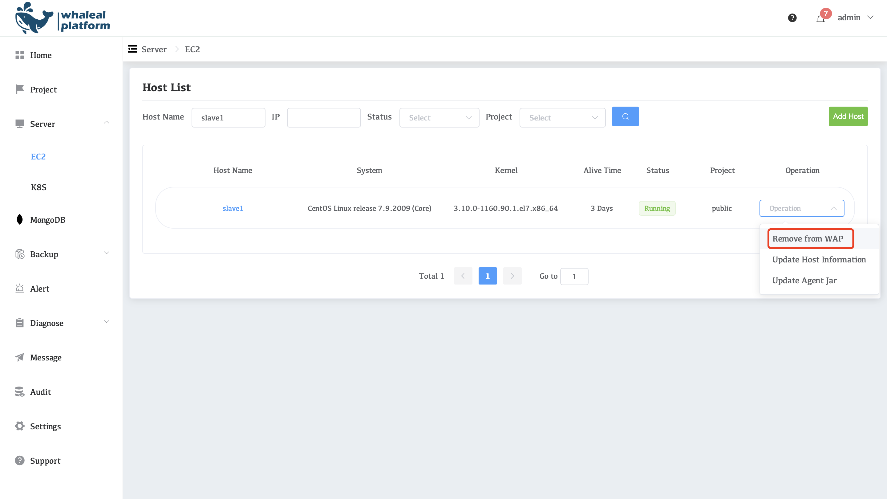
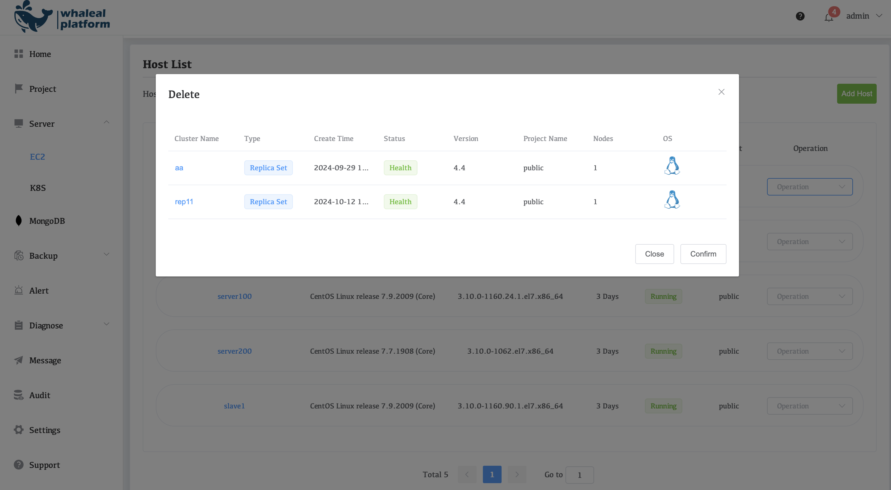
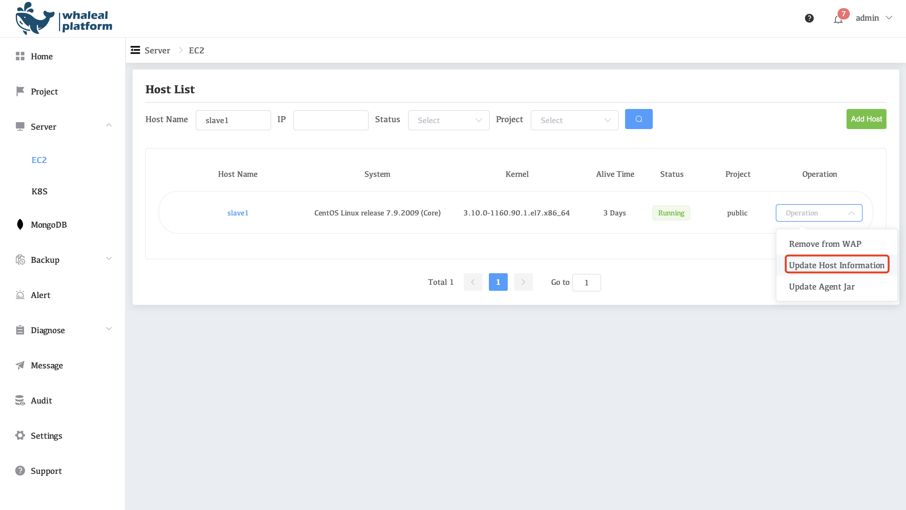
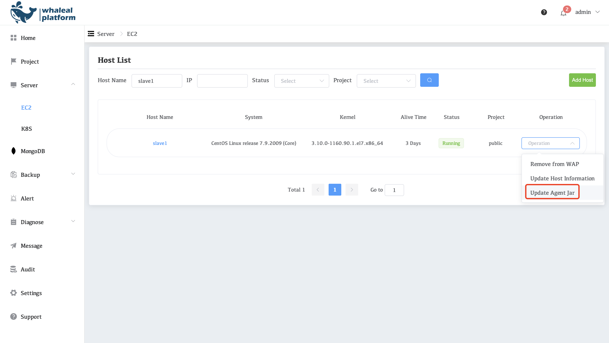

# Manage Agent

### Remove from WAP

This operation is used to remove the MongoDB cluster or server that no longer needs to be monitored or managed from the WAP platform. After removal, WAP will no longer collect monitoring data for the node or provide related management functions.

When removing the agent, if there is mongodb, you need to remove mongodb from the management before removing the agent. To remove mongodb, please refer to[Stop Managing and/or Monitoring One Deployment](../../05-manage-deployments/05-stop-managing-and-or-monitoring-one-deployment.md)

### Update Host Information

Update Host Information, refresh the host configuration information, such as IP address, port, host name, etc. When the server configuration changes, WAP needs to update this information synchronously to ensure that the platform can continue to correctly monitor and manage related nodes.

### Update Agent Jar

WAP communicates and monitors MongoDB instances through agents. This operation will re-update the agent program on the current host to the version corresponding to the current WAP server to ensure the stability and compatibility of the platform.

