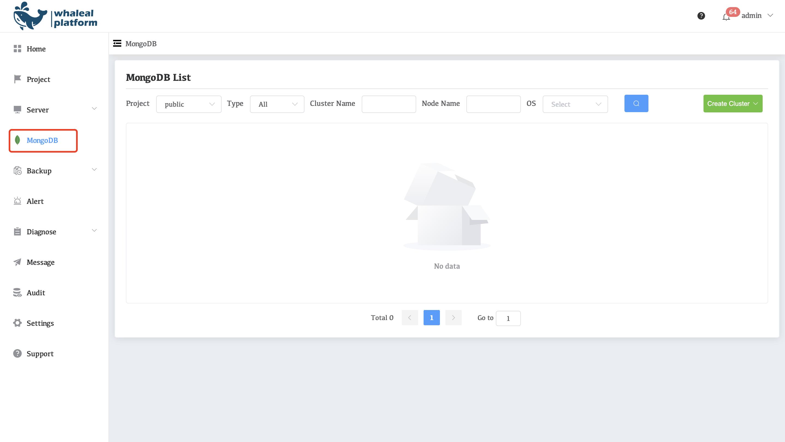
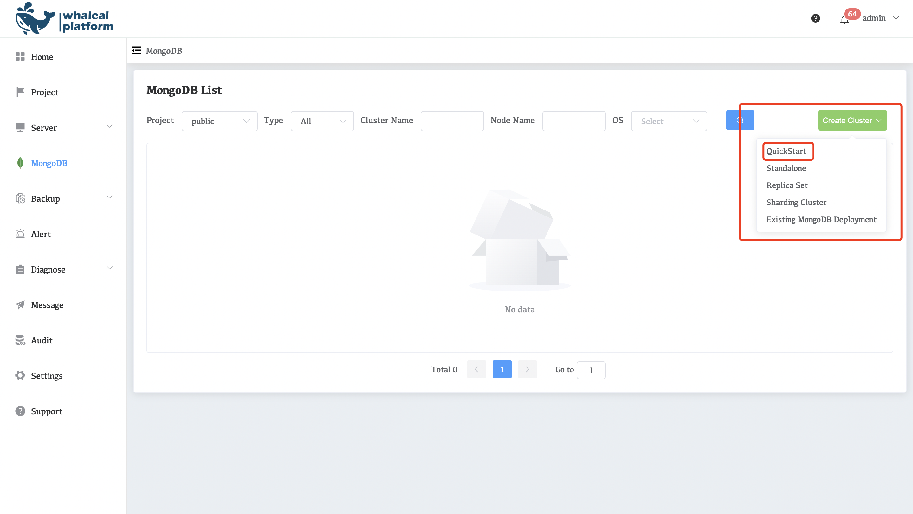
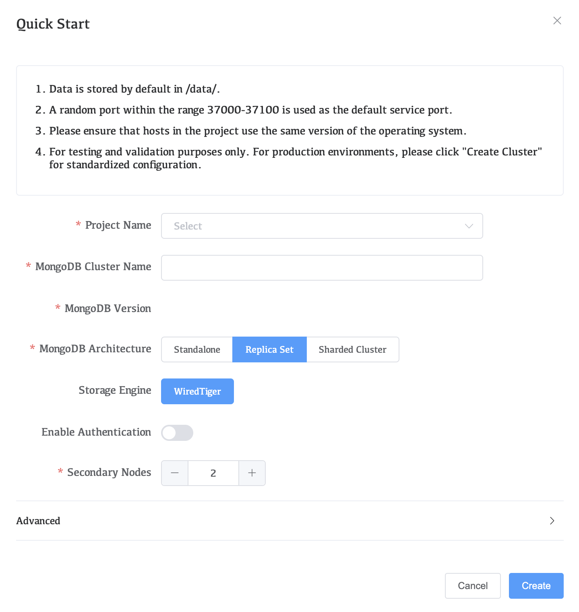
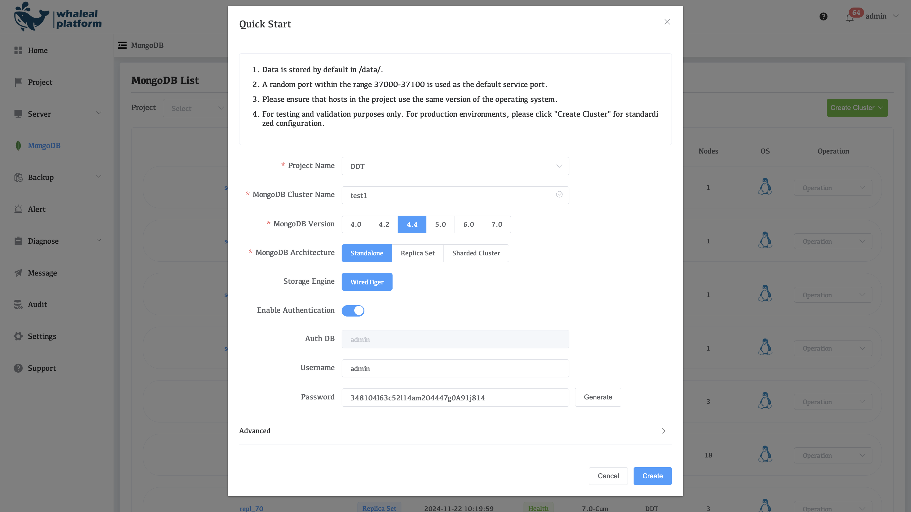
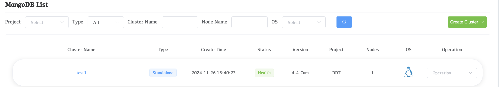
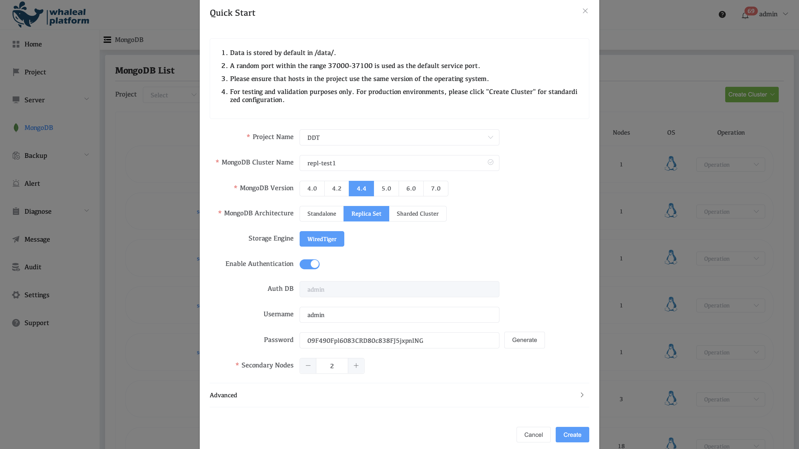
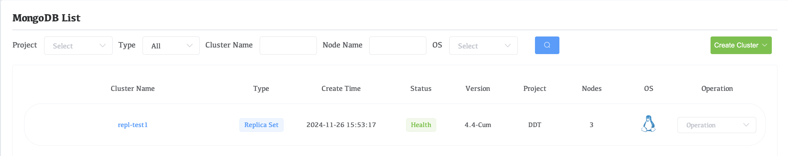
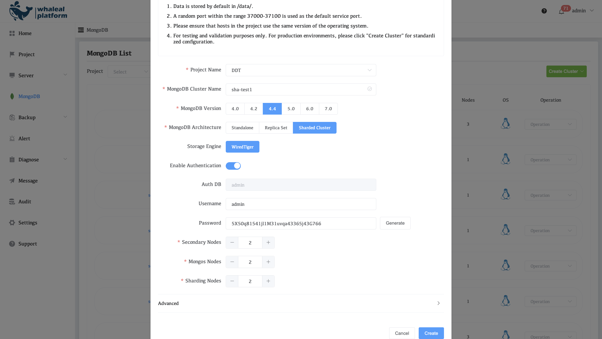
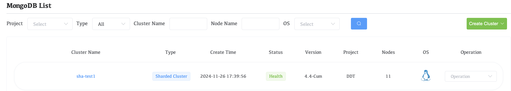

# Quick Start mongodb

If you use Quick Start to create mongodb, you need to add the host reference in wap in advance:[Manually add Agent](./02-add-ec2/03-manually-add-agent.md) And upload the mongodb media package reference:[MongoDB Package](../13-settings/01-mongodb-package.md)

## Get Started

**Click mongodb on the left**

**Click create Cluster on the right and select Quick Start**

**Go to Quick Start page**

**main issues**

- Data is stored by default in /data/.
- A random port within the range 37000-37100 is used as the default service port.
- Please ensure that hosts in the project use the same version of the operating system.
- For testing and validation purposes only. For production environments, please click "Create Cluster" for standardized configuration.

## Rapid deployment of single node

**configuration parameters**

| Parameter Name        | illustrate                                               |
| --------------------- | -------------------------------------------------------- |
| Project Name          | Select the project name where you need to create mongodb |
| MongoDB Cluster Name  | The name that identifies the single node instance        |
| MongoDB Version       | Select the MongoDB version for your MongoDB deployment.  |
| MongoDB Architecture  | Select the type of MongoDB cluster you want to deploy    |
| Storage Engine        | MongoDB storage engine                                   |
| Enable Authentication | Enable mongodb authentication                            |
| Auth DB               | current MongoDB authentication library                   |
| Username              | MongoDB Username                                         |
| Password              | MongoDB Password                                         |
| Advanced              | You can specify the Data Path and Port range             |

**After selecting, click create**

Waiting for creation to complete

## Replication Set Rapid Deployment

**configuration parameters**

| Parameter Name        | illustrate                                               |
| --------------------- | -------------------------------------------------------- |
| Project Name          | Select the project name where you need to create mongodb |
| MongoDB Cluster Name  | The name that identifies the single node instance        |
| MongoDB Version       | Select the MongoDB version for your MongoDB deployment.  |
| MongoDB Architecture  | Select the type of MongoDB cluster you want to deploy    |
| Storage Engine        | MongoDB storage engine                                   |
| Enable Authentication | Enable mongodb authentication                            |
| Auth DB               | current MongoDB authentication library                   |
| Username              | MongoDB Username                                         |
| Password              | MongoDB Password                                         |
| Secondary Nodes       | Select the number of Secondary Nodes                     |
| Advanced              | You can specify the Data Path and Port range             |

**After selecting, click create**

Waiting for creation to complete

## Fast deployment of sharded clusters

**configuration parameters**

| Parameter Name        | illustrate                                               |
| --------------------- | -------------------------------------------------------- |
| Project Name          | Select the project name where you need to create mongodb |
| MongoDB Cluster Name  | The name that identifies the single node instance        |
| MongoDB Version       | Select the MongoDB version for your MongoDB deployment.  |
| MongoDB Architecture  | Select the type of MongoDB cluster you want to deploy    |
| Storage Engine        | MongoDB storage engine                                   |
| Enable Authentication | Enable mongodb authentication                            |
| Auth DB               | current MongoDB authentication library                   |
| Username              | MongoDB Username                                         |
| Password              | MongoDB Password                                         |
| Secondary Nodes       | Select the number of Secondary Nodes                     |
| Mongos Nodes          | Select the number of Mongos Nodes                        |
| Sharding Nodes        | Select the number of Sharding Nodes                      |
| Advanced              | You can specify the Data Path and Port range             |

**After selecting, click create**

Waiting for creation to complete

