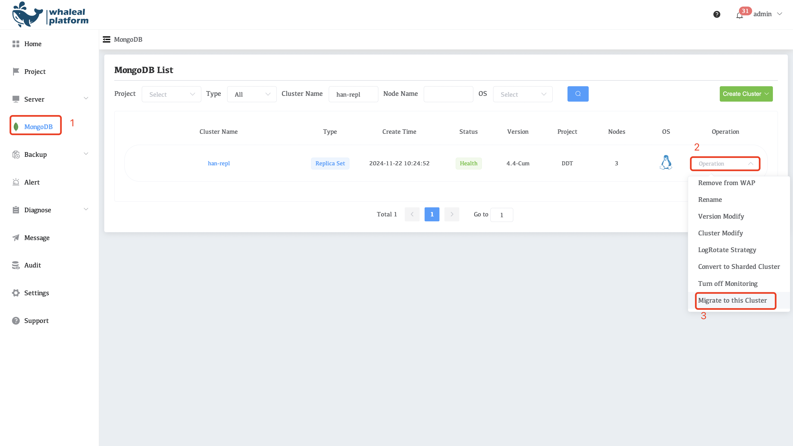
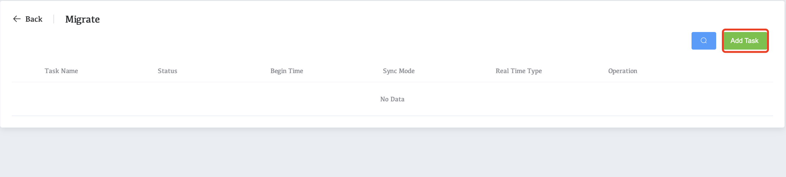
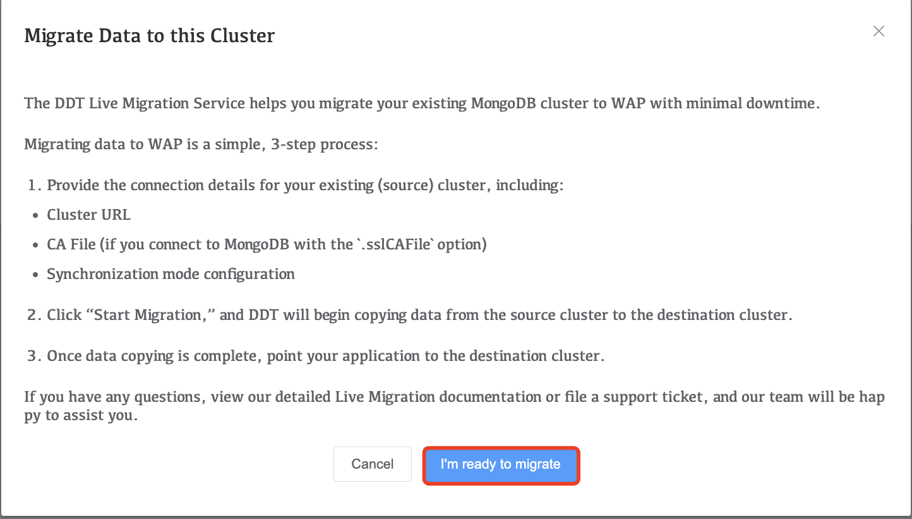
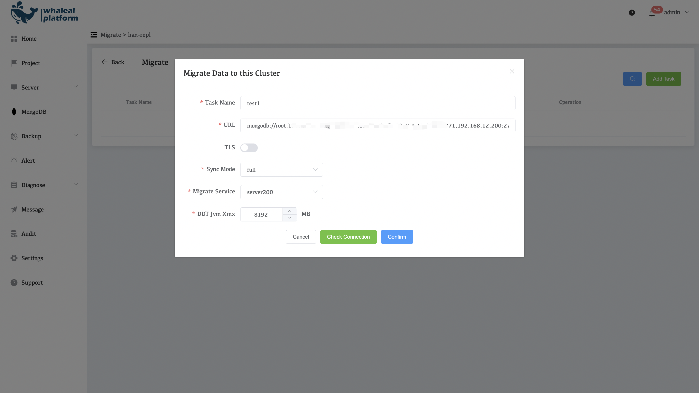
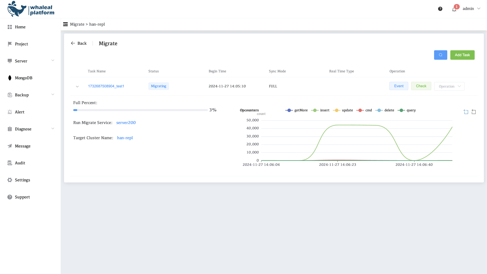
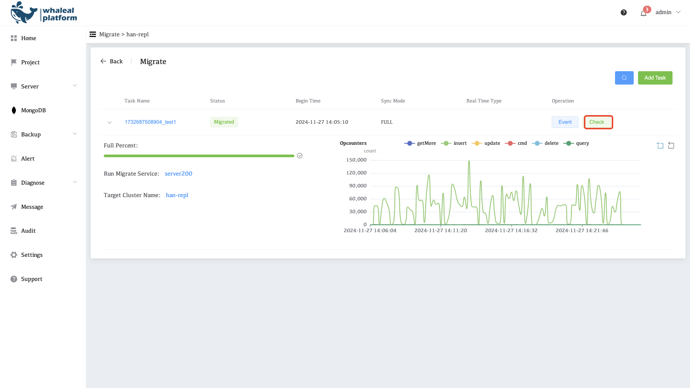
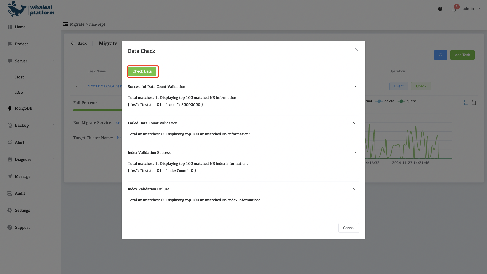

# Migrate to this Cluster

Migrate to this Cluster is a key feature of Whaleal Platform (WAP) that enables efficient migration of MongoDB data. Whether it is a single node, replica set or sharded cluster, this feature supports easy migration, with features such as full synchronization, real-time synchronization, and progress monitoring, ensuring data security and reliability, helping users significantly improve migration efficiency and reduce operational complexity.

## How to use

Click **MongoDB** on the left, select your MongoDB cluster, click **operation** and select **Migrate to this Cluster**.

Click **Add Task**

Review the notes for Migrate Data to this Cluster, and then click **I'm ready to migrate**.

Migrate configuration

**configuration introduce**

| Parameter Name  | illustrate                                                   |
| --------------- | ------------------------------------------------------------ |
| Task Name       | The name of this task                                        |
| URL             | The mongodb connection URL of the source end                 |
| TLS             | TLS If the source end enables TLS authentication, you need to specify the Ca.crt and Client.pem files |
| Sync Mode       | Migration mode, supports full and fullAndRealTime            |
| Migrate Service | Migrate the required DDT servers                             |
| DDT Jvm Xmx     | Specify the DDT Jvm memory allocation size                   |

After the configuration is complete, click **Check Connection**. After verification is successful, click **Confirm** 

start the migration

Wait for the migration to complete and click **Check**

Check the data to verify whether it is normal

Data migration completed