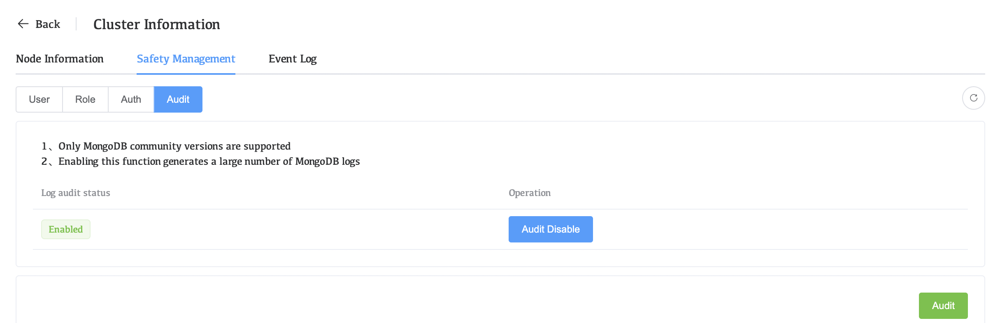
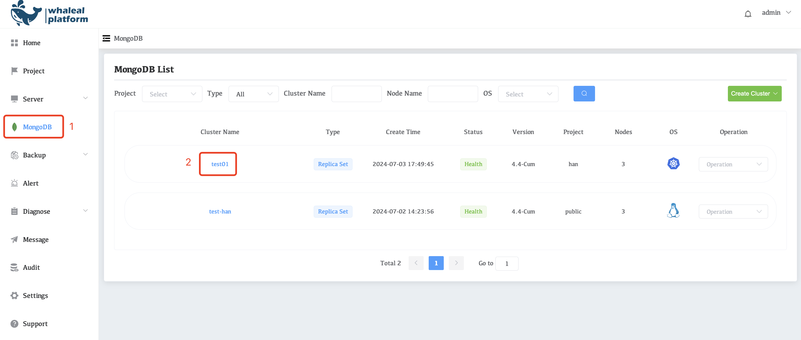
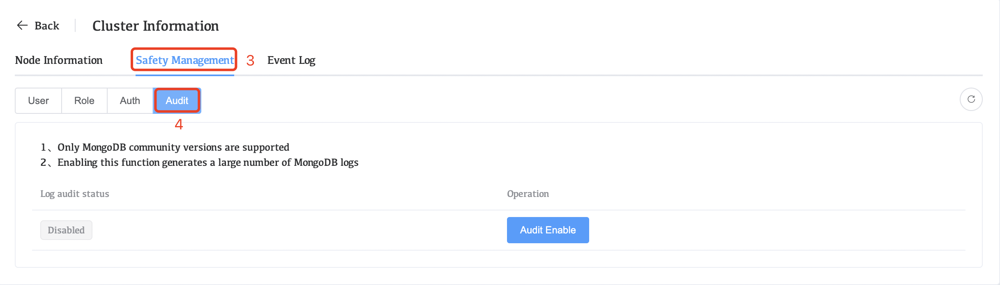
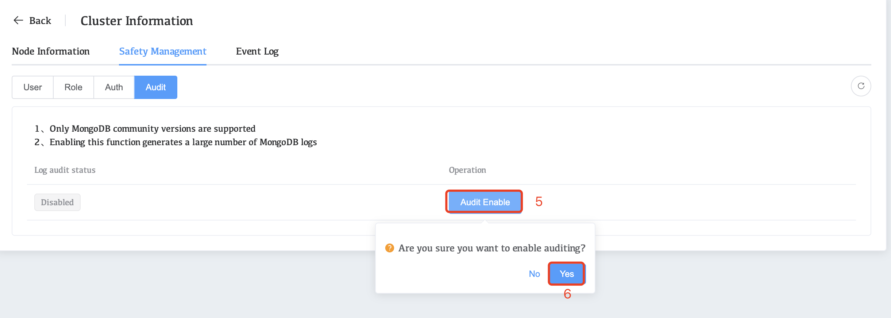
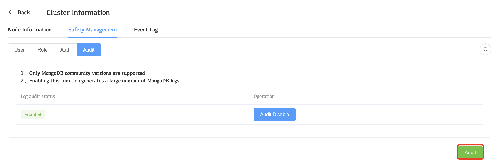
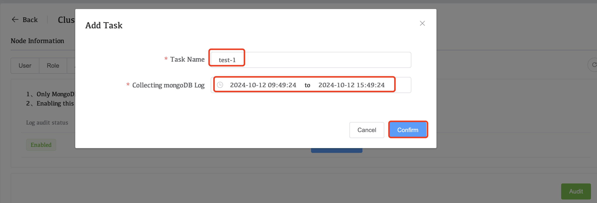
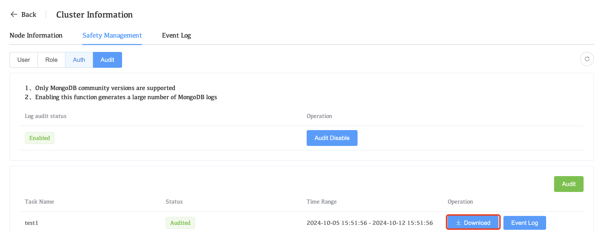
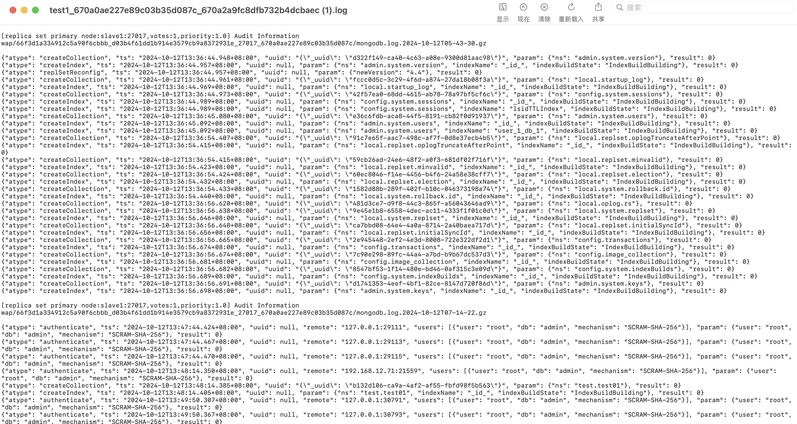

# Configure and Deploy Auditing

The WAP platform supports the MongoDB community version and enables the MongoDB audit function, which can record key information such as user operations, request methods, cluster operations, user logins, etc. These audit logs help administrators to detect potential security risks or abnormal behaviors in a timely manner.

## Go to the audit start page

1. Click **MongoDB** in the left navigation bar

2. Select the **Cluster Name** for which auditing needs to be enabled

3. Click Safety **Management**

4. Click **Audit**

**Notice**

1. Only MongoDB community versions are supported

2. Enabling this function generates a large number of MongoDB 

## Enable audit function log

1. Click on **mongodb**

2. Select the **Cluster Name** you want to configure.

     

3. Click Safety **Management**

4. Click **Audit**

     

5. Click **Audit Enable** and select yes

     

## View the audit log

1. Click on audit

     

2. Fill in the task name and the time range of the log and click "confirm"

     

3. Click Download to view logs after completing the task

     

4. View logs after download

     

