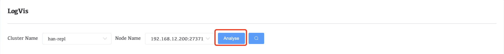
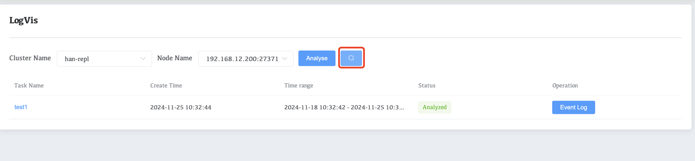
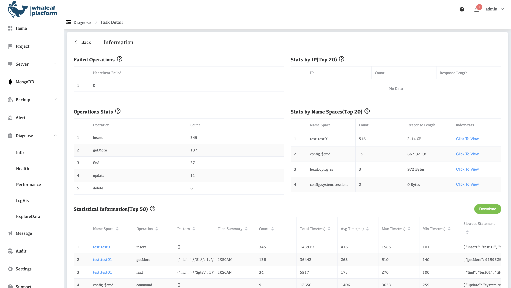
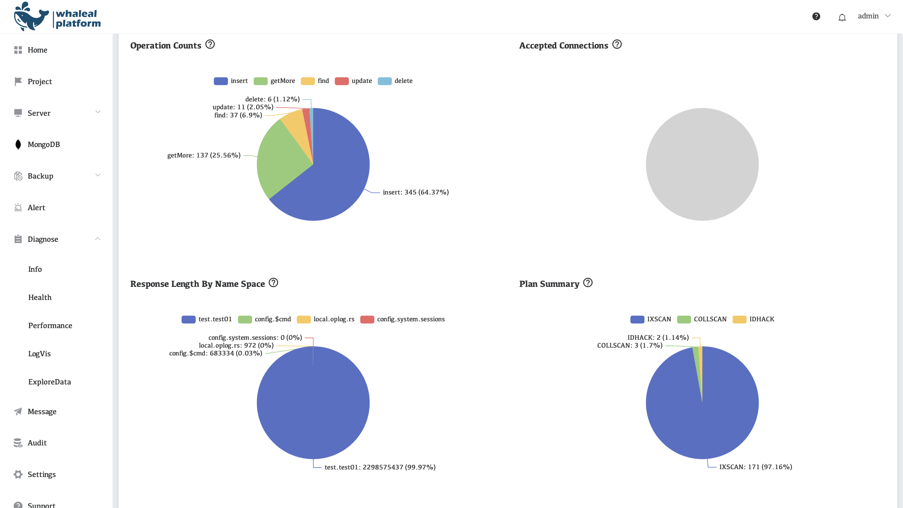
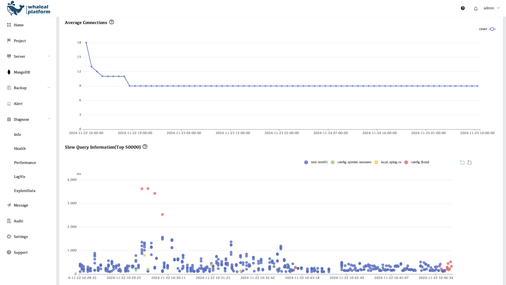

# LogVis

Before using LogVis, you need to configure S3 storage in the settings in advance

LogVis can view the slow query statistics in the logs within a certain period of time. To view the statistics, follow the steps below:

1. Select Cluster Name and Node Name, then click the Analyze **button**.

     

2. Wait for a while and click the **magnifying glass icon** to view the analysis results

     

## View LogVis

Click on the task name to view details when analysis is complete

| Parameter Name                  | illustrate                                                   |
| ------------------------------- | ------------------------------------------------------------ |
| Failed Operations               | Represents the number of unexpected crashes in the MongoDB cluster. |
| Stats by IP(Top 20)             | Displays statistics of the top 20 IPs involved in slow queries, including query frequency and total response size. |
| Operations Stats                | Statistics of operation types in slow queries, including their frequency and total duration. |
| Stats by Name Spaces(Top 20)    | Displays information on the top 20 namespaces involved in the most slow queries, including their total response size and index stats. |
| Statistical Information(Top 50) | Analyzes the top 50 slow query patterns, including namespaces, operations, CPU usage, and execution times. |

| Parameter Name                | illustrate                                                   |
| ----------------------------- | ------------------------------------------------------------ |
| Operation Counts              | Displays the total count of different operations performed in the MongoDB system. |
| Accepted Connections          | Shows the number of accepted client connections to the MongoDB instance. |
| Response Length By Name Space | Represents the total response size (in bytes) for each namespace in the MongoDB system. |
| Plan Summary                  | Provides a breakdown of the number of queries executed for each plan type in MongoDB. |

| Parameter Name                    | illustrate                                                   |
| --------------------------------- | ------------------------------------------------------------ |
| Average Connections               | Represents the number of active client connections to the MongoDB instance. |
| Slow Query Information(Top 50000) | Represents the top 50,000 slowest queries recorded in MongoDB. |
