# ExploreData

Explain Plan (execution plan) is used to explain the execution method and optimization strategy of query statements. By analyzing the execution plan, administrators can understand the execution of the query, discover potential performance bottlenecks, and optimize it. You can optimize query statements, create appropriate indexes, or adjust the storage structure of the collection based on the execution plan to improve query efficiency and overall performance.

1. Select Cluster Name

     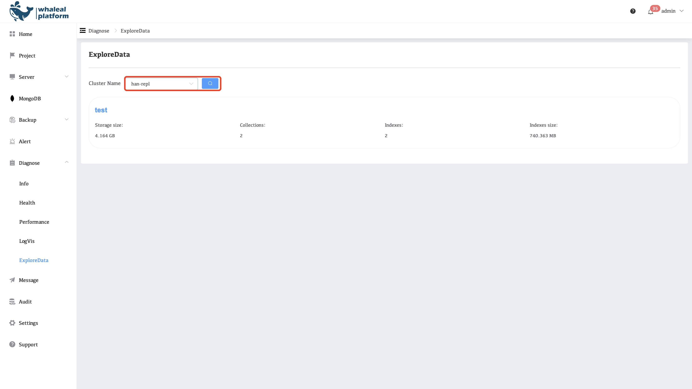

2. Select a database and click on it to enter the database.

     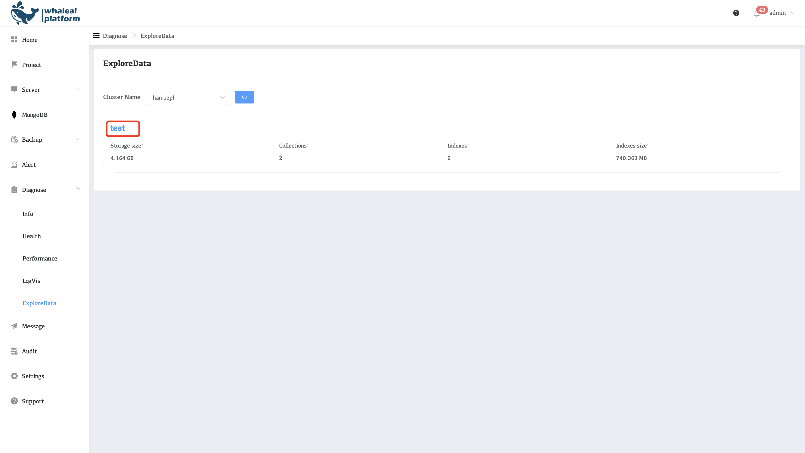

3. Select a collection and click on it to enter the collection.

     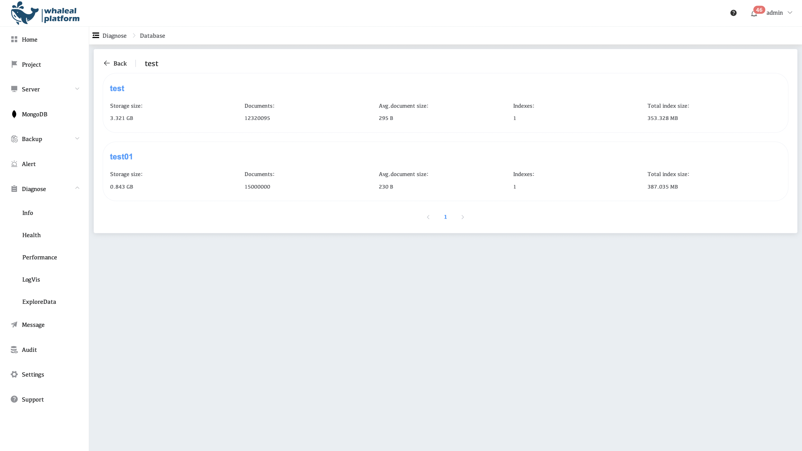

4. Fill in the statement to be executed in the **FILTER**, and then click the **Find** button

     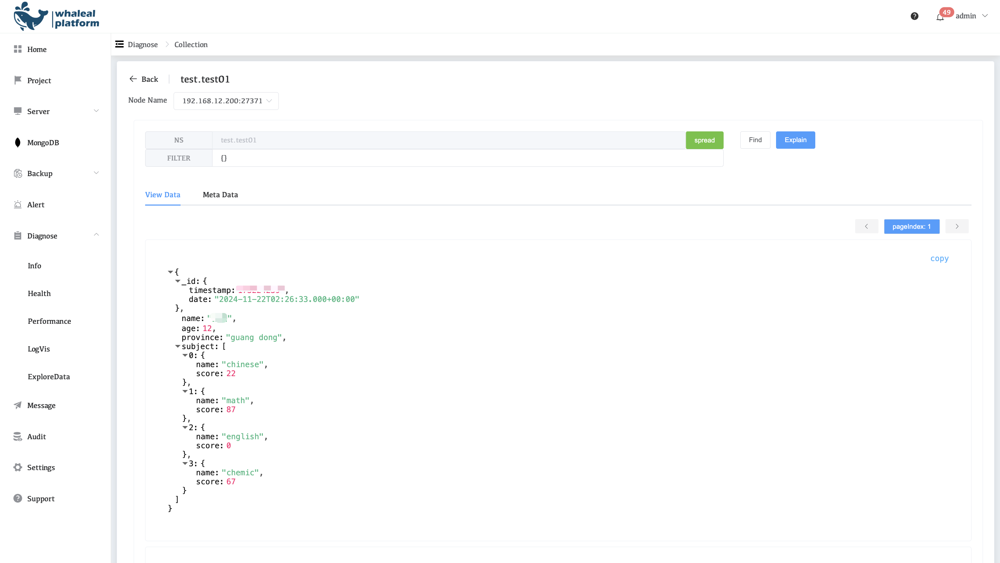

     

## FInd

### View Data

Display data information in the database

### Meta Data

**Meta information**

This page contains MongoDB collection information

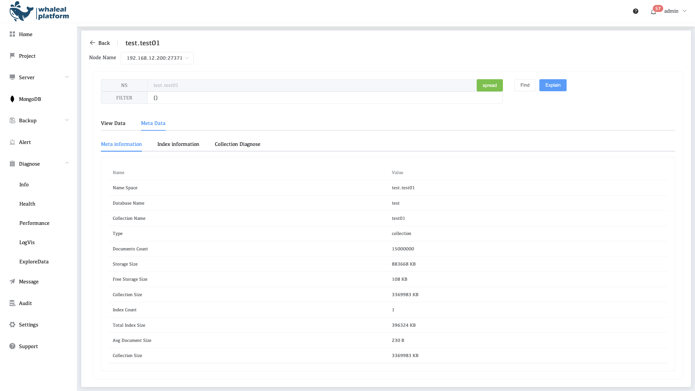**Index information**

This page contains all index information in the collection

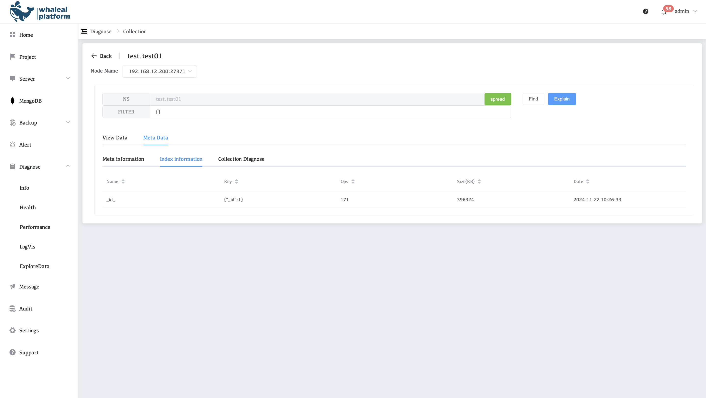

**Collection Diagnose**

This page contains some diagnostic information about the current collection.

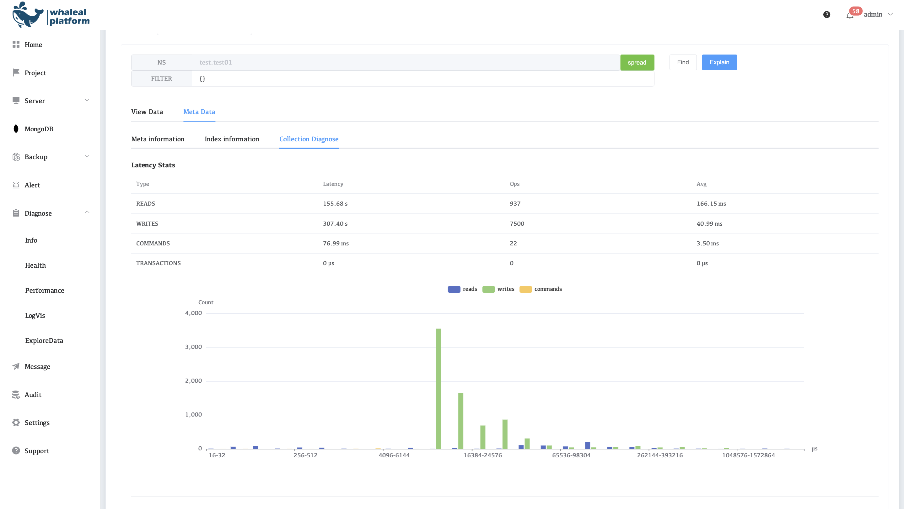

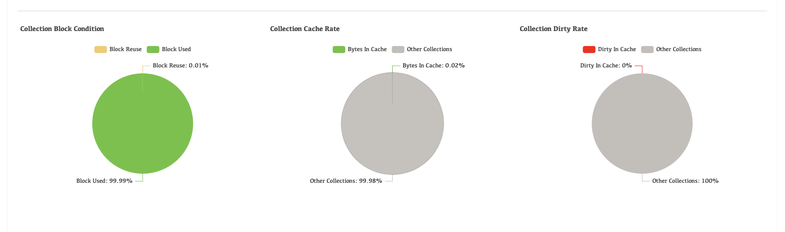

## Explain Result

Fill in the statement to be executed in the **FILTER**, and then click the **explain** button

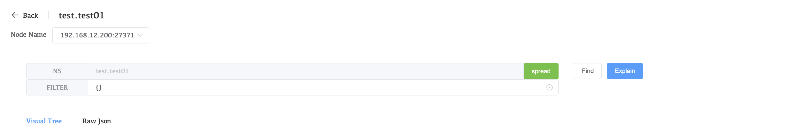

### Visual Tree

Formatted explain result

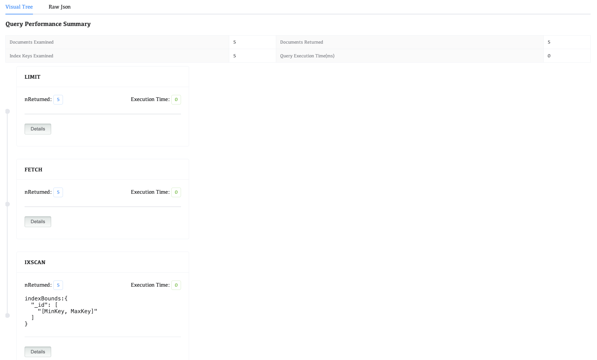

### Raw Json

Complete explain result

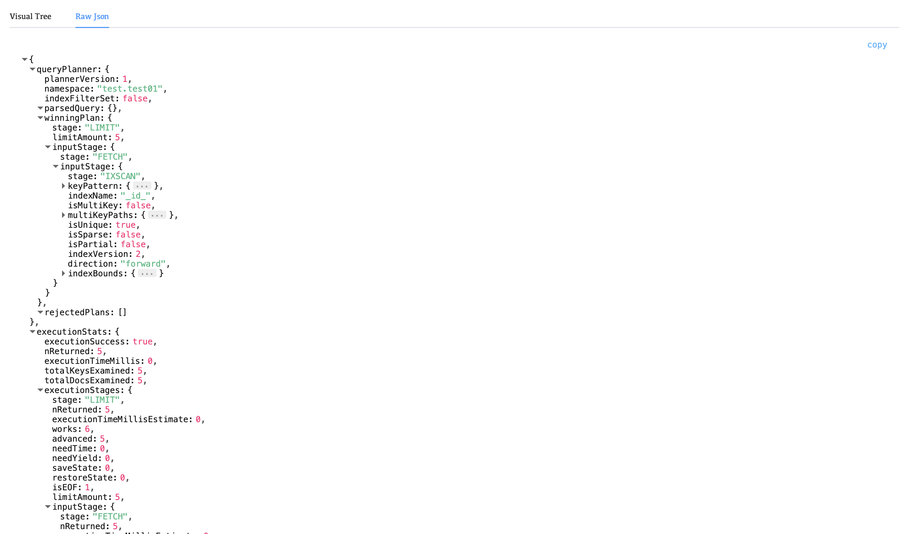
