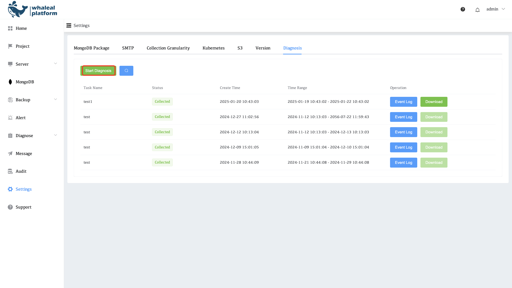
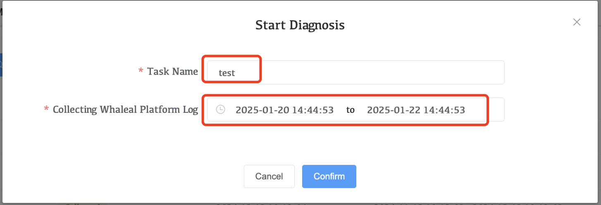
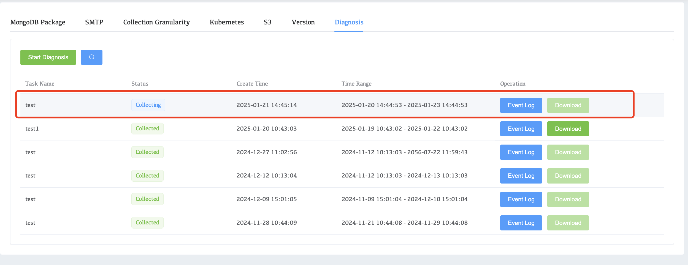
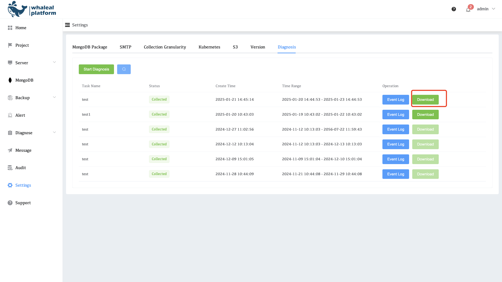

# Diagnosis

The WAP platform supports comprehensive collection of logs and diagnostic information. The system can extract application logs from the server within a specified time range, collect log files from multiple proxy servers, and export diagnostic data from the appDB database, all of which are automatically uploaded to S3 storage. The platform also generates a pre-signed URL valid for one day, through which users can easily download and view log files.

Use the diagnosis steps:

1. Click start diagnosis

     

2. Fill in the task name and time range and click confirm to obtain the diagnostic log.

     

3. Waiting for the winning diagnostic message to complete

     

4. Click download when diagnostic information is acquired

     

