# Quick Start On AWS  Marketplace

## Installation Requirements

This guide outlines the requirements and preparation steps needed to deploy the Whaleal Platform (WAP) and its MongoDB agent on the AWS Marketplace.

By following this guide, you can prepare for a successful deployment and avoid common setup issues.

### Whaleal Platform

#### Hardware Requirements

**Minimum Requirements:** 8 cores, 16GB of RAM, 500GB disk space.

<table>
  <tr>
    <th>Node Number</th>
    <th>CPU</th>
    <th>Memory</th>
    <th>Disk</th>
  </tr>
  <tr>
    <td>50</td>
    <td>8+</td>
    <td>16GB+</td>
    <td>500GB+additional storage for logs</td>
  </tr>
  <tr>
    <td>200</td>
    <td>16+</td>
    <td>32GB+</td>
    <td>500GB+additional storage for logs</td>
  </tr>
  <tr>
    <td>200+</td>
    <td colspan="3">Please contact the Whaleal Team for specific requirements.</td>
  </tr>
</table>
**Operating System Requirements**

<table>
  <tr>
    <th>Operating System</th>
    <th>Version</th>
    <th>Architecture</th>
  </tr>
  <tr>
    <td>Amazon</td>
    <td>Linux</td>
    <td>2023 x86_64</td>
  </tr>
</table>

#### Software Requirements

**Java Environment Requirements**

<table>
  <tr>
    <th>JAVA</th>
    <th>Version</th>
  </tr>
  <tr>
    <td>open-jdk</td>
    <td>17.0</td>
  </tr>
</table>

#### Network Requirements

**TCP**

Ensure that all Whaleal Platform Application services can communicate effectively over TCP/IP.

* Whaleal Platform Application Database
* Whaleal Platform Application Agent Monitor MongoDB

**Hosts**

To ensure plug-and-play functionality, the Whaleal Platform Server requires the external IP to be open.

**Port**

The Whaleal Platform Application must meet the following basic requirements:

* Users and the Whaleal Platform Application Agent must be able to access via HTTP/HTTPS requests.
* The Whaleal Platform Application must be able to access the Whaleal Platform Application Database.
* All Whaleal Platform Applications and Whaleal Platform Application Agents must be able to access the monitored and managed MongoDB services.
* The Whaleal Platform Application must be able to send information to users via email, DingTalk, Feishu, Webhook.

The Whaleal Platform Application must open the following ports:

<table>
  <tr>
    <th>Service</th>
    <th>Default Port</th>
    <th>Transport</th>
    <th>Direction</th>
    <th>illustrate</th>
  </tr>
  <tr>
    <td>Whaleal Platform</td>
    <td>80</td>
    <td>TCP</td>
    <td>Inbound</td>
    <td>Web Access</td>
  </tr>
</table>

If a custom port is needed, please open the  port.

**Port at host**

<table>
  <tr>
    <th>Service</th>
    <th>Default Port</th>
    <th>Transport</th>
    <th>Direction</th>
  </tr>
  <tr>
    <td>ssh</td>
    <td>22</td>
    <td>TCP</td>
    <td>Inbound</td>
  </tr>
</table>

### MongoDB - Agent

#### Hardware Requirements
Minimum: 2 cores, 4GB RAM

**Operating System**

<table>
  <tr>
    <th>Operating System</th>
    <th>Version</th>
    <th>Architecture</th>
  </tr>
  <tr>
    <td>Amazon</td>
    <td>2023</td>
    <td>x86_64</td>
  </tr>
</table>

#### Software Requirements

**Java Environment Requirements**

<table>
  <tr>
    <th>JAVA</th>
    <th>Version</th>
  </tr>
  <tr>
    <td>open-jdk</td>
    <td>17.0</td>
  </tr>
</table>

#### Network Requirements

**Port**

The Whaleal Platform Application Agent must meet the following basic requirements:

* Users and the Whaleal Platform Application must be able to access the server and MongoDB.
* Therefore, the Whaleal Platform Application must open the following ports:

<table>
  <tr>
    <th>Service</th>
    <th>Default Port</th>
    <th>Transport</th>
    <th>Direction</th>
  </tr>
  <tr>
    <td>MongoDB</td>
    <td>27017</td>
    <td>TCP</td>
    <td>Inbound、Outbound</td>
  </tr>
</table>

​    If a custom port is needed, please open the custom port.

**Port at host**

The Whaleal Platform Application Agent can complete most operations, but some processes require administrator access to the Whaleal Platform Application host. The following ports must be open:

<table>
  <tr>
    <th>Service</th>
    <th>Default Port</th>
    <th>Transport</th>
    <th>Direction</th>
  </tr>
  <tr>
    <td>ssh</td>
    <td>22</td>
    <td>TCP</td>
    <td>Inbound</td>
  </tr>
</table>

## Installation Deployment

### Subscribe to Whaleal Platform Server

#### Subscribe to the service

Search for Whaleal Platform in the AWS Marketplace

Click "Continue to Subscribe" to subscribe to the service.

Click "Accept Terms" to agree to the service terms.

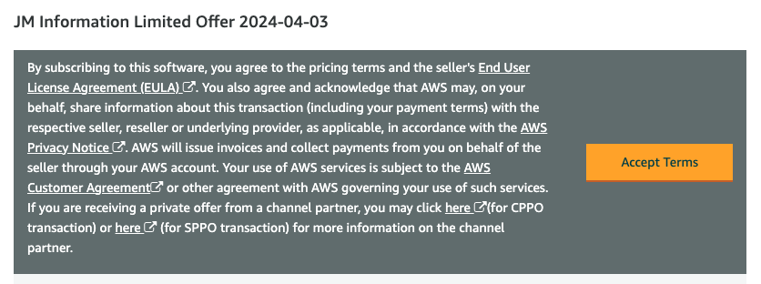

Click "Continue to Configuration" to proceed with the setup.

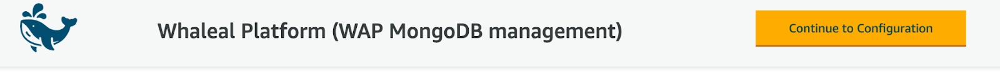

Configure instance, version, region, and pricing-related information.

***Note***: When selecting a version, please choose the latest version.

Click "Continue to Launch" to proceed to the next step.

Select "Launch through EC2" and then click "Launch" to deploy the instance in EC2.

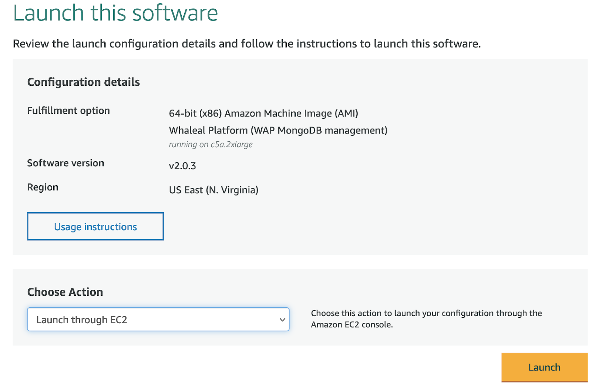

#### Instance deployment

Configure instance name

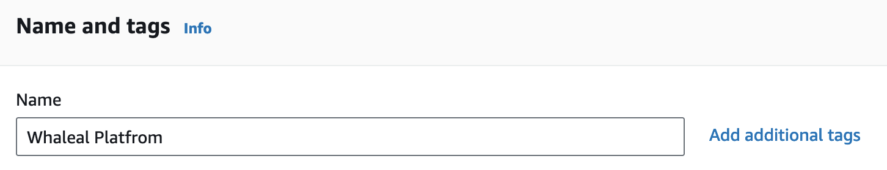

Configure instance type

Minimum instance type: 8 cores, 16GB RAM, 500GB

Configure key pair

Configure network and ports

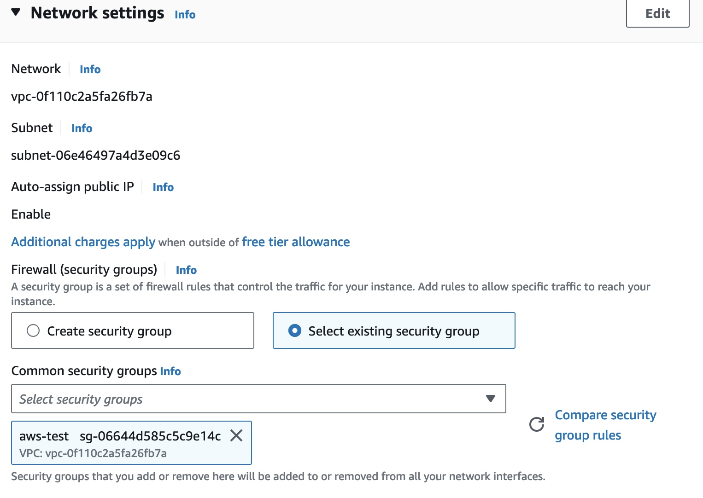

Add storage volume

Minimum requirement: 500GB

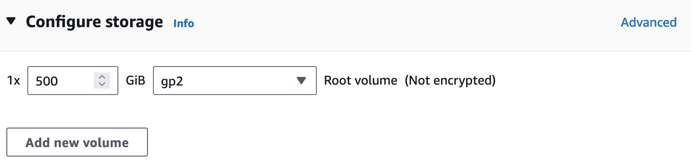

Then create the machine

#### Whaleal Platform Server Deployment

Confirm that the boot services are starting on the Whaleal Platform servernginx service

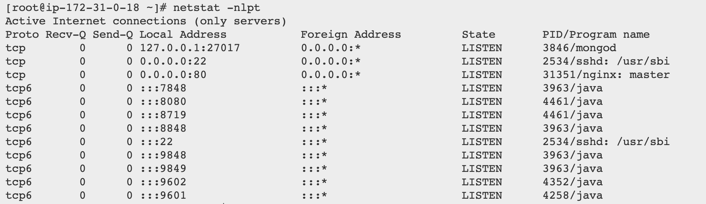

Enter the Whaleal Platform URL in your browser,Public IP address of this machine

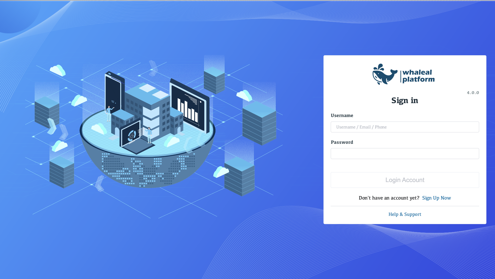

The initial password is admin password

Reset password on first login

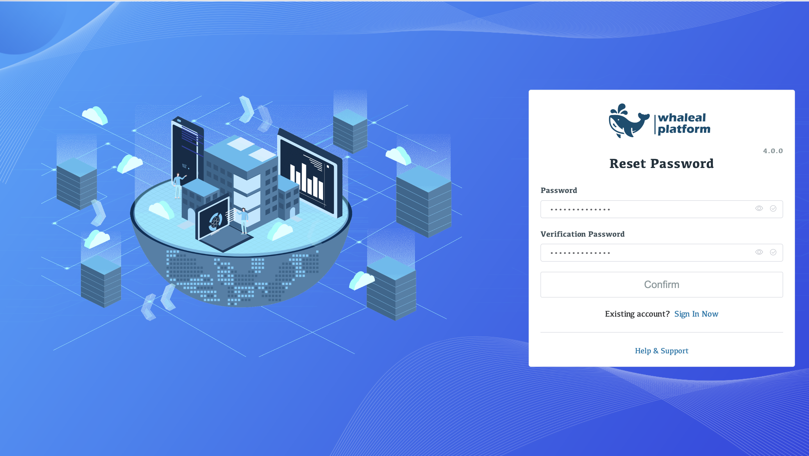

Display the home page upon successful login

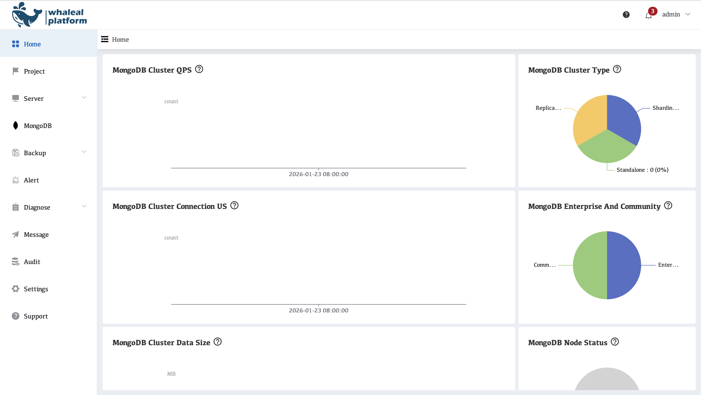

Link your AWS account to WAP

Follow the steps to create an AWS user, copy the key information into the application, and click save.

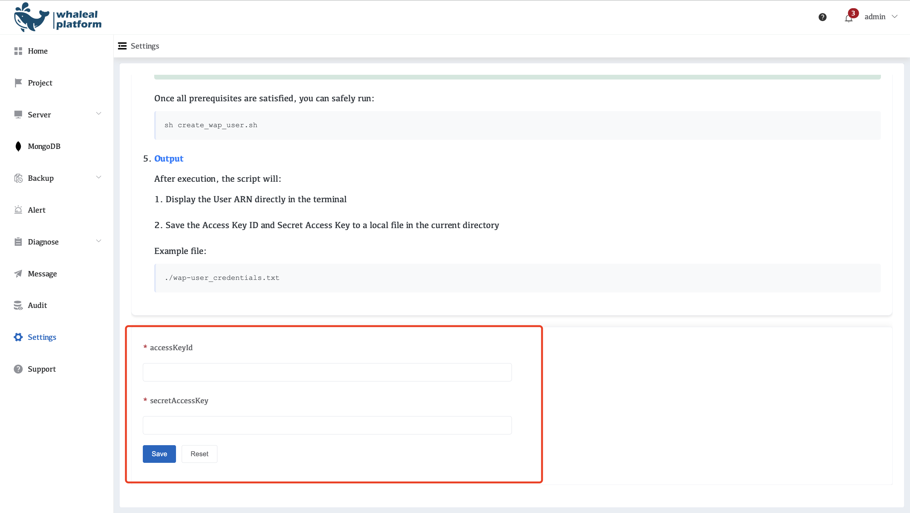

### Deploy single-instance replica set

Uploading a MongoDB package requires manually downloading the binary installer from the MongoDB website and clicking *click Upload*. Note that currently only Amazon 2023 systems are supported.

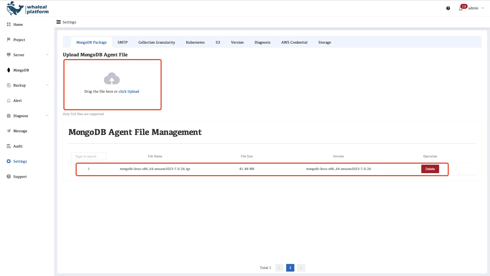

Create Project

Used to create a new project in WAP to manage and monitor a group of MongoDB instances or hosts, and to assign project members and related resources.

Select the region and CIDR where you want to deploy MongoDB, then click Create.

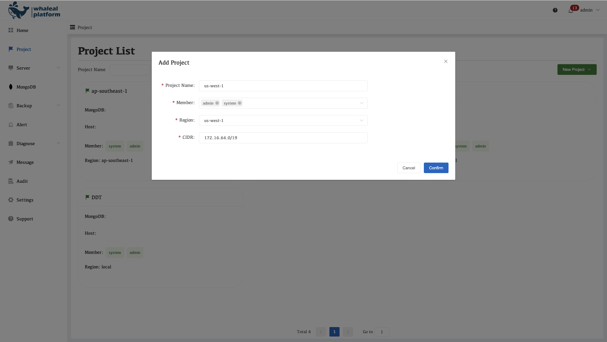

Deploying MongoDB

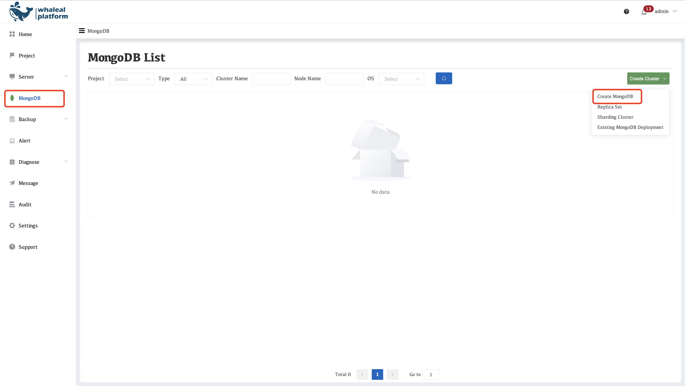

Select your MongoDB configuration

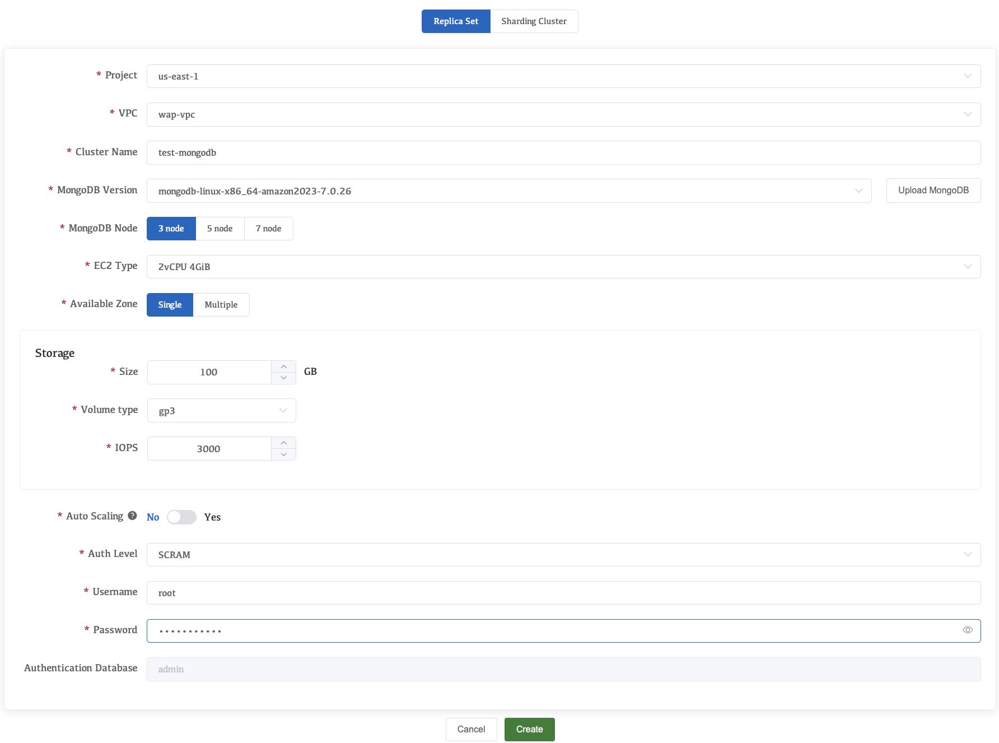

Parameter description

<table>
  <tr>
    <th>Configuration Name</th>
    <th>introduce</th>
  </tr>
  <tr>
    <td>Project</td>
    <td>Select the project you created</td>
  </tr>
  <tr>
    <td>VPC</td>
    <td>Select VPC; wap-vpc is automatically created by the WAP platform.</td>
  </tr>
  <tr>
    <td>Cluster Name</td>
    <td>Enter your MongoDB cluster name</td>
  </tr>
  <tr>
    <td>MongoDB Version</td>
    <td>To select the MongoDB version, you need to add the downloaded installation package from the previous WAP session.</td>
  </tr>
  <tr>
    <td>MongoDB Node</td>
    <td>Select the number of nodes in the cluster</td>
  </tr>
  <tr>
    <td>EC2 Type</td>
    <td>Select the instance type for the cluster.</td>
  </tr>
  <tr>
    <td>Available Zone</td>
    <td>Instance availability zone selection: Note that a cluster can only have 3 availability zones. If the number of nodes exceeds 3, there will still be duplicate nodes assigned to the same availability zone.</td>
  </tr>
  <tr>
    <td>Storage</td>
    <td>Cluster storage configuration, select Size, Volume type, IOPS, etc.</td>
  </tr>
  <tr>
    <td>Auto Scaling</td>
    <td>When your cluster resources reach capacity limits, AutoScale will automatically scale up the cluster instance type and increase instance storage capacity. This may result in additional costs.</td>
  </tr>
  <tr>
    <td>Auth Level</td>
    <td>Select the MongoDB authentication authorization level</td>
  </tr>
  <tr>
    <td>Username</td>
    <td>MongoDB cluster username</td>
  </tr>
  <tr>
    <td>Password</td>
    <td>MongoDB cluster password</td>
  </tr>
  <tr>
    <td>Authentication Database</td>
    <td>The default authentication database for MongoDB clusters is admin and cannot be changed.</td>
  </tr>
</table>

After configuration, click Create.

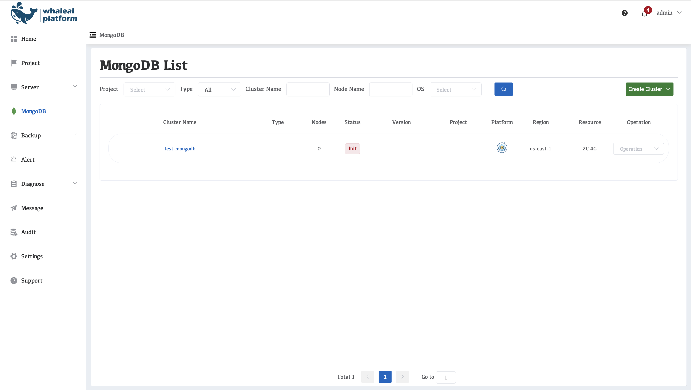

View the current progress through the logs, click on the cluster name.

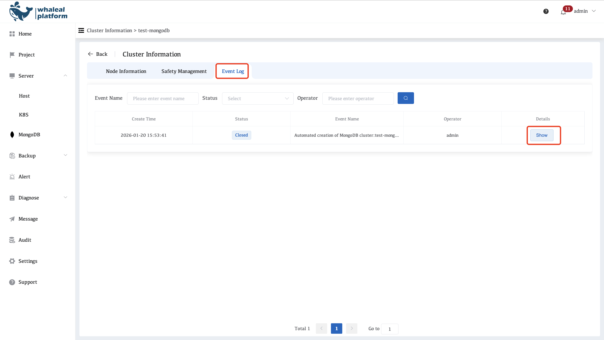

View log information

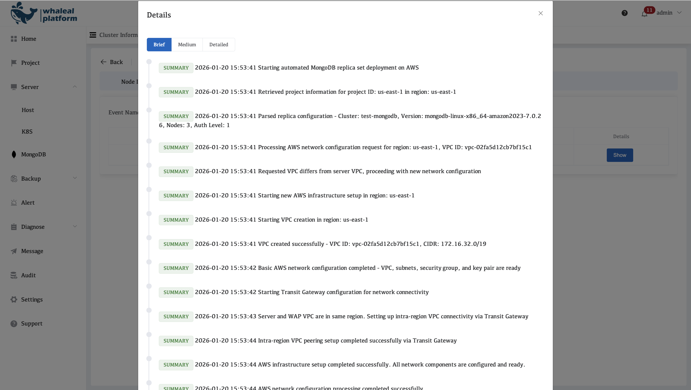

Waiting for the MongoDB cluster to complete creation; the status should be "Healthy".

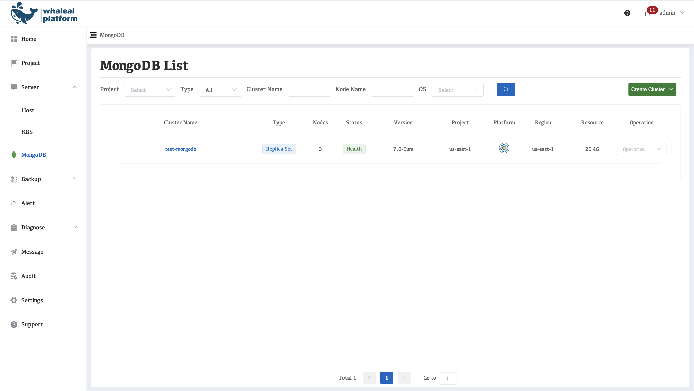

Click the cluster name to view the node status.

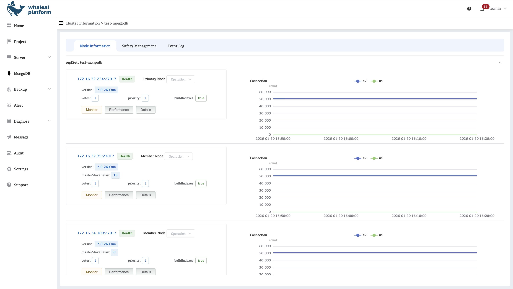
