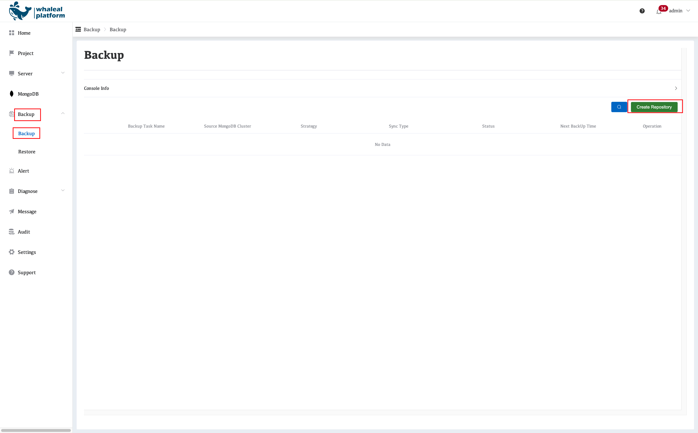
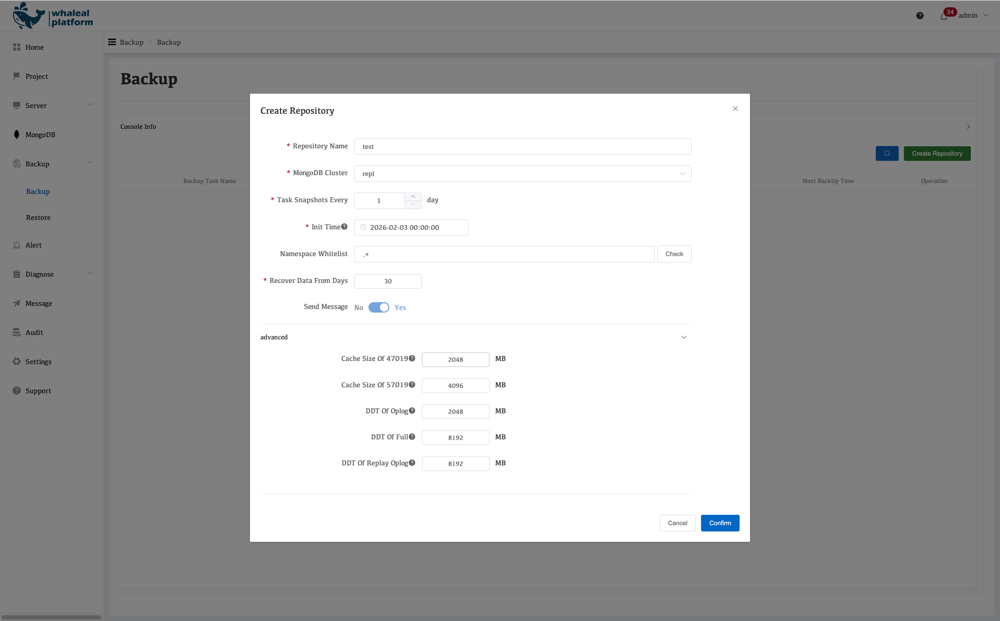
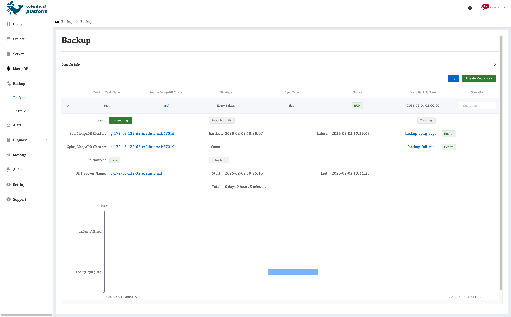
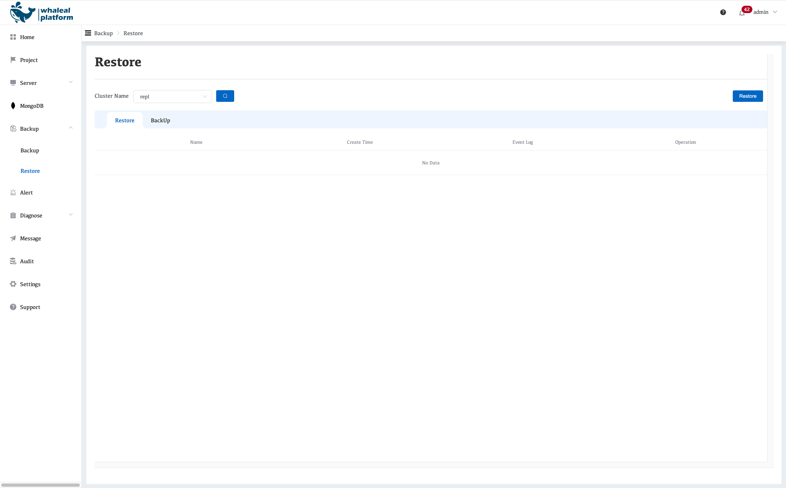
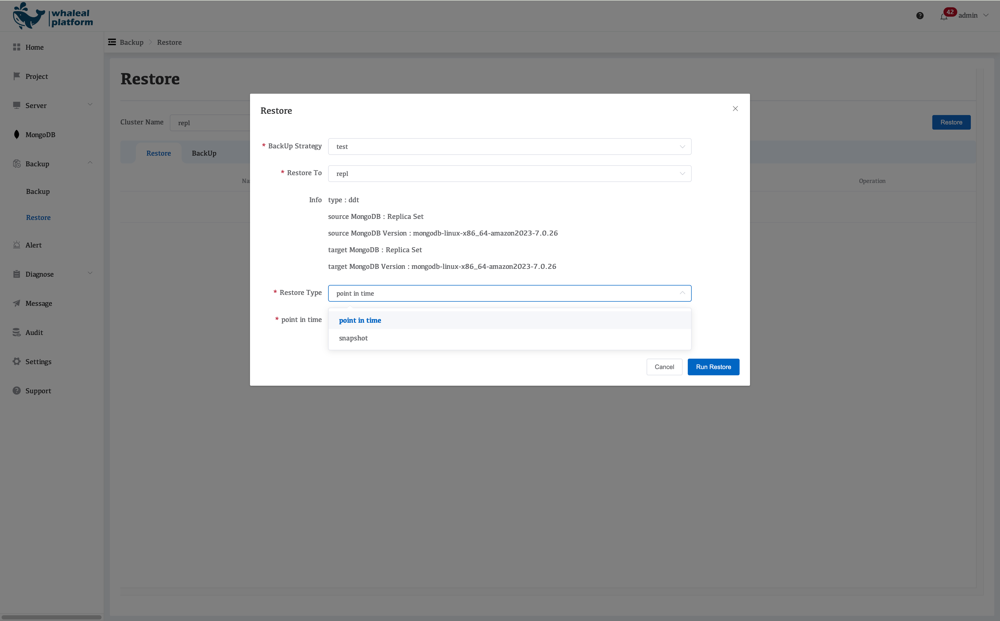

# MongoDB Backup and Restore Workflow on AWS with WAP

This document describes the **overall architecture, execution workflow, and resource planning strategy** for MongoDB backup and restore provided by Whaleal Platform (WAP) for automatically deployed MongoDB clusters in an AWS environment.

---

## I. Architecture Overview

### 1. Architecture Components

The MongoDB backup and restore system in WAP consists of the following components:

- **MongoDB Cluster**
  - Replica set or sharded cluster
  - Provides full data and oplog sources

- **WAP Server**
  - Responsible for backup policy distribution, task scheduling, and status management

- **DDT Server (Backup & Restore Execution Node)**
  - Dedicated EC2 instance
  - Executes actual MongoDB backup and restore operations

- **Backup Storage**
  - Local disk or object storage (depending on deployment strategy)

---

### 2. Network and Data Flow

- MongoDB nodes communicate with the DDT Server over the **internal network**
- All backup and restore data traffic **does not pass through the WAP Server**
- The WAP Server acts only as:
  - Control Plane
  - Scheduler, auditor, and visualization layer

---

## II. Backup Workflow

### 1. Backup Policy Configuration

Navigate to **Backup → Backup**, then click **Create Repository** to create a backup policy.

When creating a backup repository in WAP, the following parameters can be configured:

- **Repository Name**
  - Name of the backup repository

- **MongoDB Cluster**
  - Select the MongoDB cluster to be backed up

- **Take Snapshots Every**
  - Backup frequency (daily)

- **Take Snapshots Every**
  - Scheduled execution time

- **Init Time**
  - Snapshot start time, using UTC time

- **Namespace Whitelist**
  - Supports specifying databases and collections
  - Backup scope is controlled via a whitelist

- **Recover Data From Days**
  - Retention period (in days)
  - Expired backups are automatically cleaned up

- **Send Message**
  - Backup notifications are enabled by default

- **Advanced**
  - Memory limit for the backup service process (default value)

---

### 2. Backup Types

WAP uses a **Full + Incremental (oplog)** backup strategy.

#### 2.1 Full Backup

- Executed periodically
- Backs up all MongoDB data
- Used as the baseline for recovery

#### 2.2 Incremental Backup (Oplog Backup)

- Based on MongoDB `oplog.rs`
- Collected continuously or on a schedule
- Enables **Point-in-Time Recovery (PITR)**

---

### 3. Backup Execution Workflow

1. WAP Server triggers a backup task based on the defined policy
2. The task is dispatched to the corresponding DDT Server
3. The DDT Server:
   - Pulls data from MongoDB Secondary nodes
   - Executes full or oplog backups
4. Backup data is written to the target storage
5. Task status and results are reported back to the WAP Server
6. The platform updates backup status and generates audit records

---

**Backup Architecture Diagram**

---

## III. Restore Workflow

Navigate to **Backup → Restore**, then click **Restore** to create a restore task.

---

### 1. Restore Methods

WAP supports the following restore options:

- **Full Restore**
- **Point-in-Time Recovery (PITR)**
- **Database / Collection-Level Restore**
- **Restore to a New Cluster (Cluster Cloning)**

---

### 2. Restore Execution Workflow

1. The user initiates a restore task in the WAP console
2. Select:
   - Target backup set
   - Restore point in time
   - Target MongoDB cluster (original or new cluster)
3. WAP Server dispatches the restore task to the DDT Server
4. The DDT Server performs:
   1. Full data restore
   2. Oplog replay in chronological order
5. Consistency checks are performed after restoration
6. Restore status is reported back to the WAP platform

**Parameter Description:**

- **Backup Strategy**
  - Name of the backup task

- **Restore To**
  - Target cluster for restoration (original cluster or a new cluster)

- **Restore Type**
  - **Point in Time**: Restore to any specified point in time
  - **Snapshot**: Restore using a selected snapshot

---

## IV. DDT Server Resource Planning and Concurrency Model

### 1. Responsibilities of the DDT Server

- Execute MongoDB full backups
- Collect and replay oplog data
- Execute restore tasks
- Support concurrent operations across multiple clusters

---

### 2. Resource Allocation Model

#### EC2-1 (Dedicated Backup Execution Node)

- **Specification**: 8 vCPU / 16 GB RAM
- **Responsibilities**:
  - MongoDB oplog backup
  - MongoDB full backup
  - Java-based oplog processing
- **Resource Consumption Model**:
  - Oplog backup: ~2 GB
  - Full backup: ~2 GB
  - Java processing: ~2 GB
- **Total**: ~14 GB

---

#### EC2-2 (Dedicated Restore Node)

- **Specification**: 4 vCPU / 10.5 GB RAM (or higher)
- **Responsibilities**:
  - Full restore
  - Oplog replay
- **Memory usage per task**:
  - ~8 GB

---

### 3. Concurrency and Throttling Strategy

- At any given time:
  - A single DDT Server executes **only one restore task**
  - Prevents IO and CPU contention

- When CPU utilization exceeds **80%**:
  - New task scheduling is automatically paused

- This ensures:
  - Each restore task completes within a controlled timeframe
  - Backup task stability is not impacted

---

## V. Sharded Cluster Backup Considerations

- **Each sharded cluster**
  - Requires at least **one dedicated DDT Server**

- Recommended EC2 specifications based on shard count:

| Shard Count | Recommended DDT Server EC2 Spec |
|------------|----------------------------------|
| 2 – 3      | 8C / 16GB (c5.2xlarge)            |
| 4 – 5      | 8C / 21GB (c5n.2xlarge)           |
| 6 – 10     | 8C / 30GB (m3.2xlarge)            |

> The more shards in the cluster, the higher the concurrency, network throughput, and memory requirements during full backup and restore operations.

---

## VI. Design Principles Summary

- **Separation of control plane and data plane**
- **Backup operations do not impact production workloads**
- **Strict throttling of restore tasks**
- **Dedicated resource pools for sharded clusters**
- **Accurate Point-in-Time Recovery (PITR) support**

> By standardizing DDT execution nodes and applying fine-grained scheduling strategies, WAP delivers highly reliable, scalable, and auditable MongoDB backup and restore capabilities in AWS environments.
`
