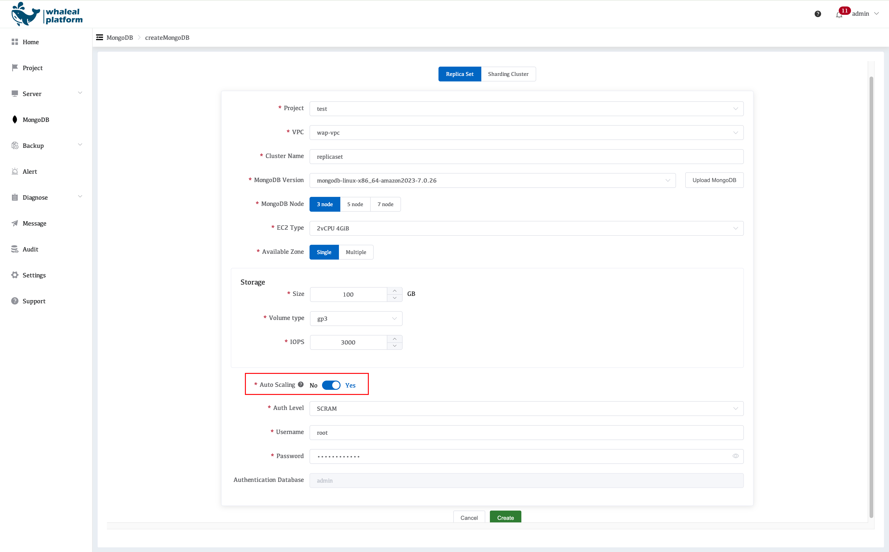
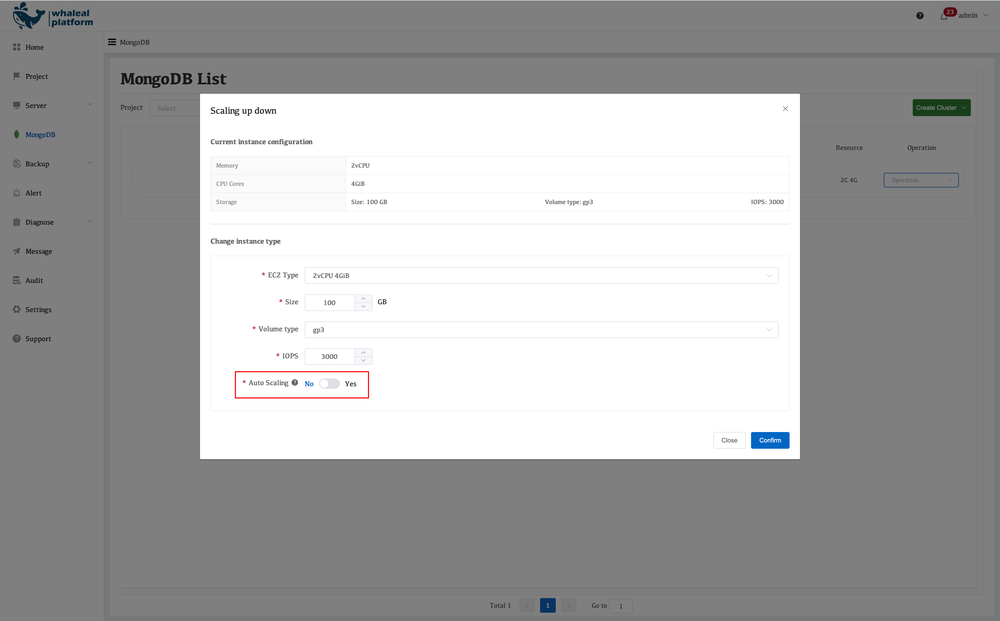

## Auto Scaling Policy Overview

### I. Auto Scaling Switch

When **creating a MongoDB cluster**, WAP provides an option to **Enable Auto Scaling**.

- **Default value:** Disabled (auto scaling is turned off)

When **modifying cluster configuration**, this parameter can be adjusted dynamically:

- Auto scaling can be enabled or disabled
- Changes take effect immediately

> **Notes**
>
> - **MongoDB Replica Sets:** Auto scaling is supported
> - **MongoDB Sharded Clusters:** Auto scaling is **not recommended**
>
> Sharded clusters involve shard count, data distribution, and load balancing.
> Automatic instance upgrades may lead to resource imbalance or workload fluctuations.
>
> 👉 When auto scaling is enabled for a sharded cluster, the platform will display a **clear risk warning**.

---

### II. Auto Scaling Trigger Conditions (EC2 Instances)

Auto scaling decisions are based on a **combined evaluation of CPU, memory, and storage metrics**.
**All metrics must meet their sustained conditions** before scaling is triggered.

---

#### 1. CPU Utilization

- **Trigger Threshold**
  CPU utilization ≥ **85%**
- **Sustained Condition**
  Within **1 hour**,
  trigger points exceed **80%**

---

#### 2. Memory Utilization (MongoDB-Specific)

- **Evaluation Basis**
  MongoDB **WiredTiger memory utilization**
- **Trigger Threshold**
  WiredTiger memory usage > **90%**
- **Sustained Condition**
  Within **1 hour**,
  trigger points exceed **80%**

> **Explanation**
> The platform focuses on MongoDB’s **actual usable working memory**, rather than raw OS-level memory usage.

---

#### 3. Storage Utilization

- **Trigger Threshold**
  Disk usage > **85%**
- **Post-Scaling Constraint**
  After expansion, **remaining disk space ≥ 40%**
- **Sustained Condition**
  Within **1 hour**,
  trigger points exceed **80%**

---

### III. Scenarios Where Auto Scaling Is Suppressed

Even if resource metrics exceed thresholds, auto scaling will **not** be triggered in the following cases, to prevent ineffective or incorrect scaling.

---

#### 1. High CPU Load Caused by Inefficient Queries

- **Detection Criteria**

  - Large number of full collection scans or sort operations
  - `SCAN_AND_ORDER` count > **10,000**
- **Sustained Condition**
  Within **1 hour**,
  trigger points exceed **80%**

> **Explanation**
> This scenario is typically caused by **missing indexes or inefficient queries**.
> Scaling up resources cannot fundamentally resolve the issue.
> **Query and index optimization should be prioritized.**

---

### IV. Auto Scaling Upgrade Strategy (EC2 Instance Types)

When scaling conditions are met and no exclusion rules are triggered, WAP automatically upgrades to the **next EC2 instance size** according to the following rules:

| Current Spec | Upgraded Spec |
| ------------ | ------------- |
| 2C / 4GB     | 4C / 8GB      |
| 4C / 8GB     | 8C / 16GB     |
| 8C / 16GB    | 16C / 32GB    |
| 16C / 32GB   | 32C / 64GB    |
| 32C / 64GB   | 64C / 128GB   |
| 64C / 128GB  | 128C / 256GB  |
| 128C / 256GB | 128C / 512GB  |

The scaling process is fully automated by WAP and includes:

- EC2 instance resizing
- Rolling service restarts (replica set mode)
- Business impact minimization

---

### V. Query Scan Metrics (Used for Scaling Decisions)

If the following metrics exceed thresholds, **auto scaling will be suppressed**.

---

#### 1. SCANNED / RETURNED

- **Definition**
  Number of index entries scanned vs. documents returned per unit time
- **Data Source**
  `totalKeysExamined` from MongoDB `explain()` output
- **Purpose**

  - Evaluate index hit ratio
  - Identify inefficient or missing indexes

---

#### 2. SCANNED OBJECTS / RETURNED

- **Definition**
  Number of documents scanned vs. documents returned per unit time
- **Data Source**
  `totalDocsExamined` from MongoDB `explain()` output
- **Purpose**

  - Detect full collection scans
  - Assist in identifying causes of abnormal CPU usage

---

### VI. Policy Summary

Auto scaling is **not a universal solution**.WAP combines **resource metrics**, **MongoDB internal behavior**, and **query characteristics** to make safe and stable scaling decisions.

This approach avoids ineffective scaling caused by SQL issues, missing indexes, or inefficient query patterns, ensuring system stability while scaling only when it truly adds value.
