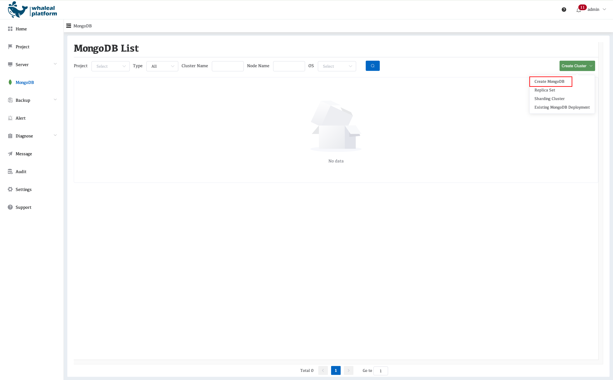
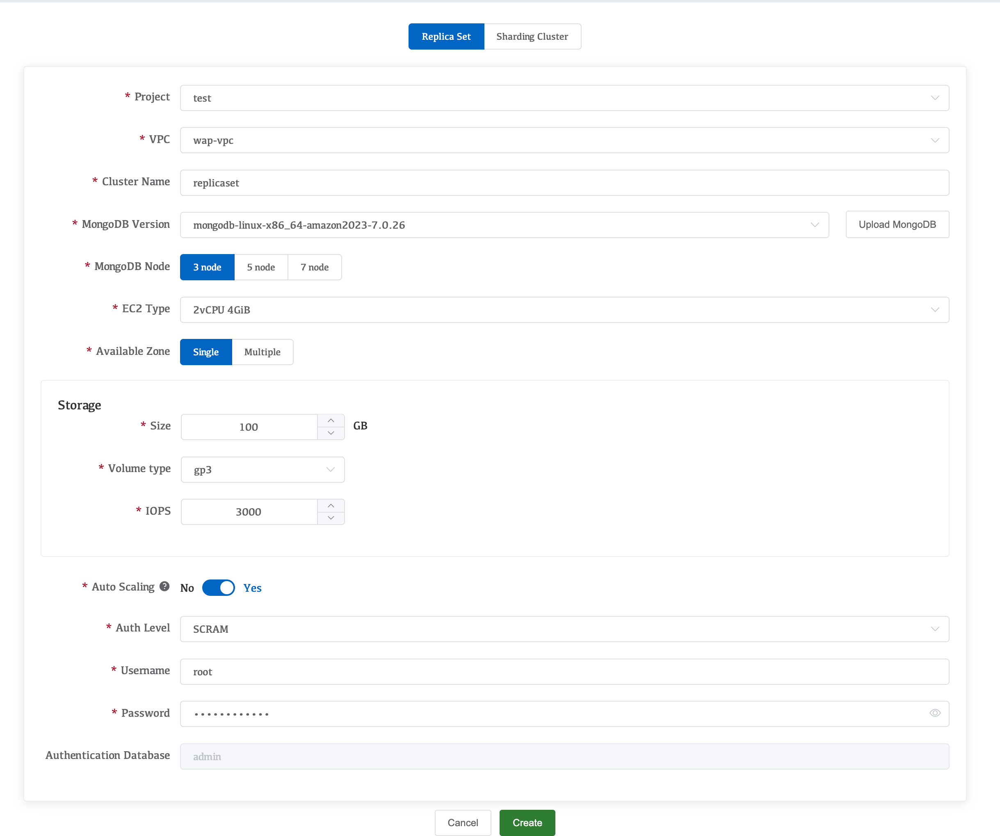

In the WAP console, click **MongoDB → Create Cluster → Create MongoDB** to enter the MongoDB cluster creation wizard.

### 1. Parameter Description

- **Project**

  - Select an existing Project, which is used for resource, network, and permission isolation.
- **VPC**
  Select the VPC used by the MongoDB cluster based on the Project’s Region:

  - **Default-VPC**
    The VPC where the WAP Server is deployed (available only when MongoDB and WAP are deployed in the same Region).
  - **wap-vpc**
    If this VPC does not exist in the current Region, WAP will automatically create it.
- **Cluster Name**

  - The name of the MongoDB replica set, used as the unique cluster-level identifier.
- **MongoDB Version**Select the MongoDB version to deploy.

  > Custom MongoDB installation packages can be uploaded via **Upload MongoDB**.
  >
- **MongoDB Node**

  - The number of nodes in the replica set, corresponding to the number of EC2 instances to be created (commonly 3 or 5 nodes).
- **EC2 Type**

  - The EC2 instance type used for MongoDB nodes, which determines CPU and memory resources.
- **Available Zone**AWS Availability Zone selection:

  - Single Availability Zone deployment
  - Multi-Availability Zone deployment (supports up to 3 AZs to improve high availability)
- **Storage**

  - **Size**
    - Data disk size, default is 100 GB.
  - **Volume Type**
    - EBS volume type, default is gp3.
  - **IOPS**
    - Baseline disk IOPS, default is 3000.
- **Auto Scaling**

  - Enables automatic scaling. When resource usage reaches defined thresholds, WAP will automatically upgrade the instance type based on built-in policies.
- **Auth Level**MongoDB authentication method:

  - Username / Password
  - Certificate-based authentication
- **Username**

  - MongoDB administrator username.
- **Password**

  - MongoDB administrator password.
- **Authentication Database**

  - MongoDB authentication database, default is `admin`.

---

### 2. Automated AWS Internal Workflow (Replica Set)

After clicking **Create**, WAP automatically performs the following steps within AWS:

1. **Resource Validation**

   Validate the Project, Region, VPC, and Availability Zones.

   Verify the integrity and version compatibility of the MongoDB installation package.
2. **Network and Security Configuration**

   Create or reuse the target VPC and subnets.

   Automatically configure Security Groups to allow required MongoDB ports.

   Configure internal network connectivity between nodes.
3. **EC2 Instance Provisioning**

   Create instances based on the selected EC2 type and AZ distribution.

   Attach gp3 data volumes and configure IOPS.

   Automatically configure hostnames and private IP addresses.
4. **Operating System Initialization**

   Execute OS tuning scripts (ulimit, sysctl, THP, NUMA, etc.).

   Install required dependencies for MongoDB runtime.
5. **MongoDB Installation and Configuration**

   Extract and install the specified MongoDB version.

   Automatically generate `mongod.conf`.

   Configure data directories, log directories, and WiredTiger parameters.
6. **Replica Set Initialization**

   Start all `mongod` instances.

   Automatically execute `rs.initiate()`.

   Complete Primary election based on node order.
7. **Authentication and Security Initialization**

   Create the MongoDB administrator user.

   Enable MongoDB authentication.

   Store credentials in the WAP centralized credential management module.
8. **Cluster Onboarding**

   Register the cluster with the WAP platform.

   Enable monitoring, logging, and alerting.

   Update the cluster status to **Running**.
