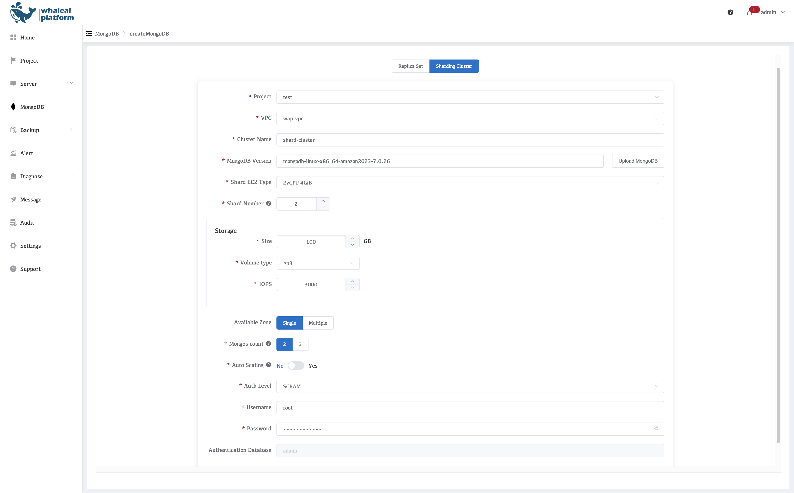

## MongoDB Sharded Cluster Creation

In the WAP console, click **MongoDB → Create Cluster → Create MongoDB**, then select **Sharded Cluster** mode.

---

### 1. Parameter Description

- **Project**

  - Select the target Project.
- **VPC**

  - Same rules as replica set creation.
- **Cluster Name**

  - Name of the MongoDB sharded cluster.
- **MongoDB Version**

  - MongoDB version to deploy. Uploading custom installation packages is supported.
- **MongoDB Node**

  - Number of nodes per Shard (typically a 3-node replica set).
- **Shard EC2 Type**

  - EC2 instance type used for Shard nodes.
- **Shard Number**

  - Minimum: 2
  - Maximum: 10
- **Storage**

  - **Size**
    - Data disk size for each Shard node.
  - **Volume Type**
    - Default: gp3.
  - **IOPS**
    - Default: 3000.
- **Available Zone**

  - Availability Zone distribution strategy for Shard nodes.
- **Mongos Count**

  - Number of Mongos router instances (deployed in the same AZs as the Shards).
- **Auto Scaling**

  - Automatic scaling policy that supports Shard node instance type upgrades.
- **Auth Level**

  - Username
  - Password**
  - Authentication Database
    - MongoDB authentication configuration, default is `admin`.

---

### 2. Automated AWS Internal Workflow (Sharded Cluster)

WAP automatically completes the following sharded cluster deployment workflow within AWS:

1. **Config Server Replica Set Creation**

   Automatically create a 3-node Config Server.

   Initialize the Config Server replica set.

   Store cluster metadata.
2. **Shard Replica Set Creation**

   Create multiple replica sets based on the Shard Number.

   Each Shard independently completes EC2 provisioning, disk attachment, and MongoDB initialization.

   Automatically execute `rs.initiate()`.
3. **Mongos Deployment**

   Create the specified number of Mongos instances.

   Configure and connect Mongos to the Config Server.
4. **Shard Registration**

   Automatically execute `sh.addShard()`.

   Register all Shards with the sharded cluster.
5. **Authentication and Authorization Initialization**

   Create a unified administrative user.

   Synchronize authentication configuration across Config Servers, Shards, and Mongos.
6. **Cluster Health Validation**

   Validate the status of Shards, Config Servers, and Mongos.

   Verify replica set health and routing status.
7. **Platform Onboarding**

   Onboard the cluster into the WAP unified monitoring and operations system.

   Enable alerting, backup, and scaling capabilities.

   Update the cluster status to **Running**.
