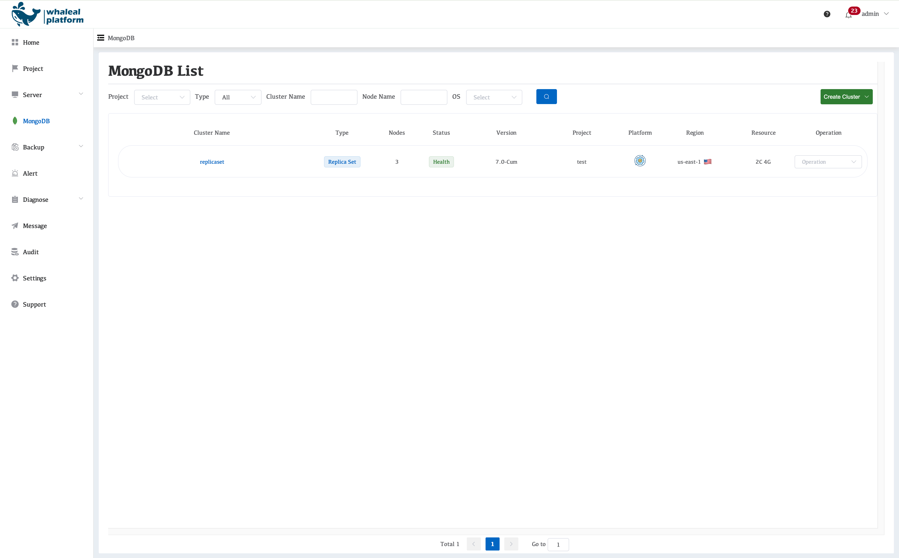
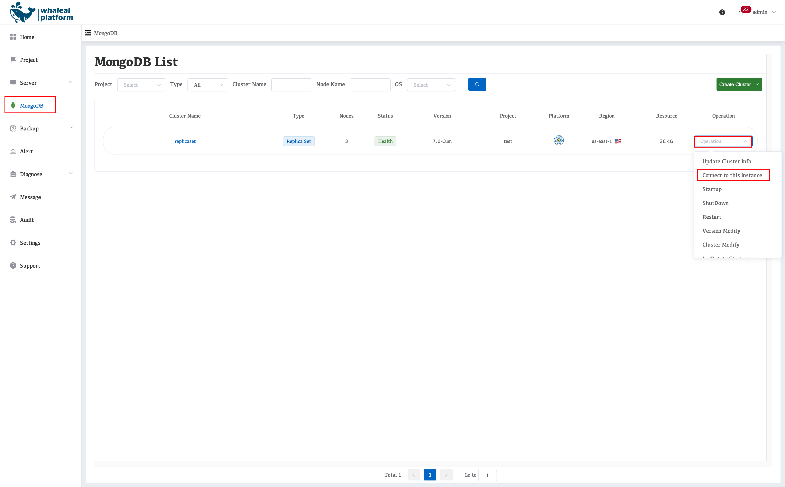

## Post-Creation Cluster Validation and Checks

After a MongoDB cluster is created, it is recommended to perform a comprehensive validation from three dimensions: **platform status verification, connectivity validation, and log inspection**. This ensures the cluster has been delivered correctly and is ready for use.

---

### I. Platform Status Verification

#### 1. Cluster Status Check

- Navigate to **MongoDB → Cluster List**
- Check the overall status of the newly created cluster:
  - **Init**: The cluster is being created
  - **Health**: The cluster has been created successfully and is running normally
  - **Error**: An exception occurred during creation or runtime

> Only when the cluster status is **Health** does it indicate that all initialization steps have been completed.

---

#### 2. Node Status Check

- Enter the cluster details page
- Review the status of each node:
  - Node role (Primary / Secondary / Arbiter)
  - Instance running status
  - CPU / memory / disk utilization

**Validation Points:**

- **Replica Set**

  - Only **one Primary** node
  - All other nodes are **Secondary**
- **Sharded Cluster**

  - Config Server, Shard, and Mongos components are all in a healthy state
  - All components are online with no active alerts

---

### II. Connectivity Validation

#### 1. Retrieving Connection Information from the Platform

On the cluster details page, you can obtain MongoDB connection information, including:

- Internal connection endpoint
- Port
- Authentication method
- Username
- Authentication database

---

#### 2. MongoDB Connection Test

Use a MongoDB client to verify connectivity, for example:

mongosh "mongodb://{username}:{password}@{host}:{port}/?authSource=admin"
