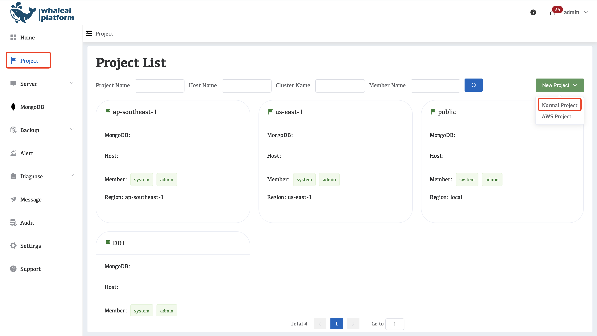
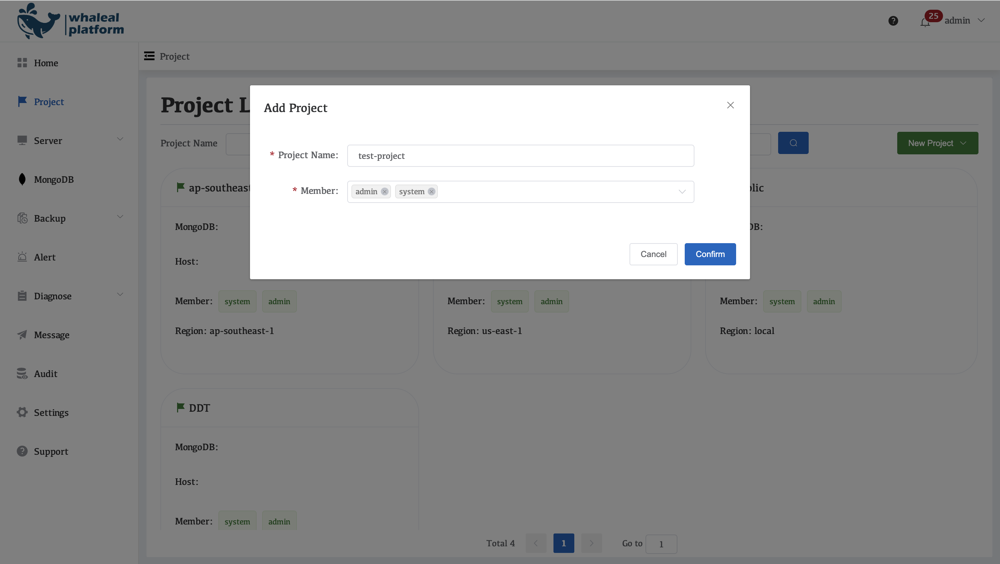
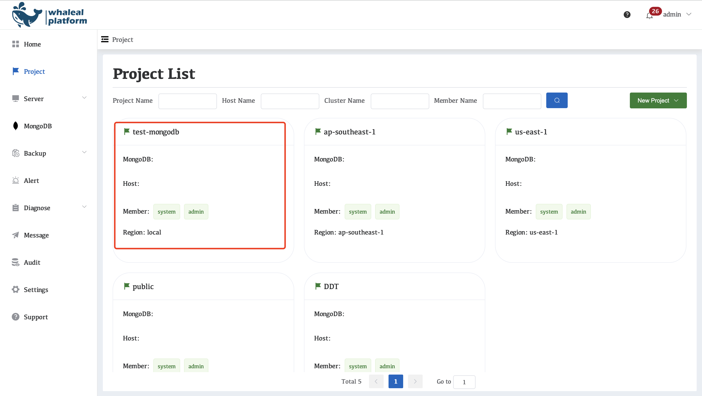
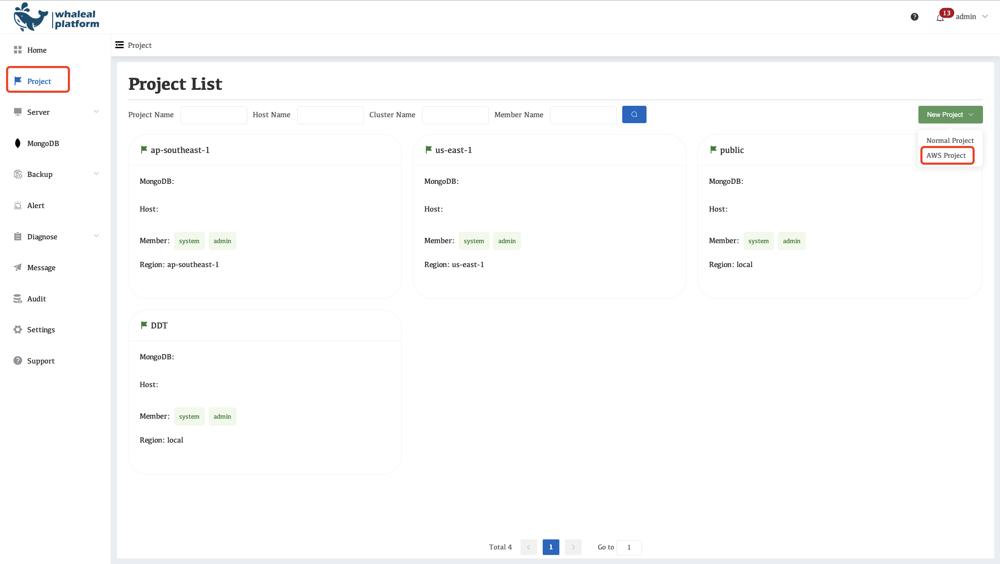

# Projects

In WAP, MongoDB deployments are organized by **projects**.  
Each project is independent, with its own monitoring, backup, and automation workflows, ensuring that different environments and workloads do not interfere with each other.

## Working with Multiple Environments

WAP provides two project types to suit different deployment and management scenarios:

- **Normal Project**: Suitable for MongoDB deployments on **local hosts or self-managed environments**, including physical servers, virtual machines, or private clouds. This type does not rely on cloud provider resources.  
- **AWS Project**: Designed for MongoDB deployments on **Amazon Web Services (AWS)**. This type integrates with cloud resources for unified deployment, monitoring, backup, and automation management.

#### **Normal Project**

For this type of project, users need to deploy and add a WAP Agent themselves to manage and monitor MongoDB deployments in local data centers, third-party clouds, or other existing environments.

Select Project Configuration

<table>
  <tr>
    <th>Configuration Name</th>
    <th>introduce</th>
  </tr>
  <tr>
    <td>Project Name</td>
    <td>Enter the name of the project you want to create, which will be used to distinguish and manage different project resources.</td>
  </tr>
  <tr>
    <td>Member</td>
    <td>Select users who can manage the project; only authorized members can access and manage the resources under the project.</td>
  </tr>
</table>

Project creation complete

#### **AWS Project**

By connecting to the AWS cloud environment, WAP automatically creates and manages the host and related network resources, enabling logical isolation of different environments, networks, or business systems. Users only need to select the AWS region and network range.

Creating AWS Projects

Parameter Description

<table>
  <tr>
    <th>Configuration Name</th>
    <th>introduce</th>
  </tr>
  <tr>
    <td>Project Name</td>
    <td>Enter the name of the project you want to create, which will be used to distinguish and manage different project resources.</td>
  </tr>
  <tr>
    <td>Member</td>
    <td>Select users who can manage the project; only authorized members can access and manage the resources under the project.</td>
  </tr>
  <tr>
    <td>Region</td>
    <td>Choose the AWS region where the project is located. This region determines the actual deployment location of the resources.</td>
  </tr>
  <tr>
    <td>CIDR</td>
    <td>Select the subnet IP range (CIDR) to be used in the project to plan the network address space.</td>
  </tr>
</table>

Click "confirm" after filling in the form.

