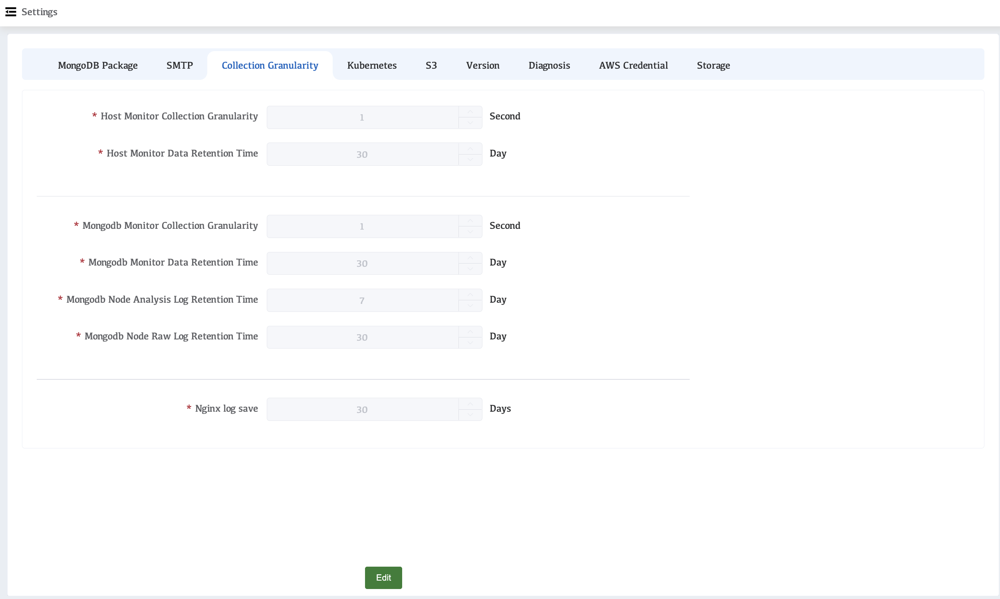

# Collection Granularity

The collection granularity configuration can set the frequency of data collection in monitoring, modify the collection granularity configuration, and modify the granularity configuration of the host and MongoDB, as well as the retention time of MongoDB node logs.

## View  Collection Granularity Configuration

1. Click **Settings** in the left navigation bar
2. Click **Collection Granularity**

### Parameter Introduction

| Parameters                               | Description                                                  |
| ---------------------------------------- | ------------------------------------------------------------ |
| Host Monitor Collection Granularity      | The frequency and level of detail with which metrics are collected and stored from monitored hosts. It determines how often metrics such as CPU usage, memory usage, disk I/O, and network traffic are sampled and recorded. |
| Host Monitor Data Retention Time         | The system will automatically delete machine monitoring data that has been stored for an extended period of time. |
| Mongodb Monitor Collection Granularity   | The frequency at which monitoring metrics are collected from the monitored MongoDB cluster. |
| Mongodb Monitor Data Retention Time      | MongoDB monitoring data is stored in the system for a specified period of time; data exceeding this period will be automatically cleaned up. |
| Mongodb Node Analysis Log Retention Time | The MongoDB node analysis logs are kept in the system for a specified period of time; logs older than this period will be automatically cleaned up. |
| Mongodb Node Raw Log Retention Time      | The time that MongoDB node raw logs are kept in the system; logs older than this time will be automatically cleaned up. |
| Nginx log save                           | Nginx retains access logs and error logs in the system for a specified period; logs older than this period are automatically cleaned up. |
