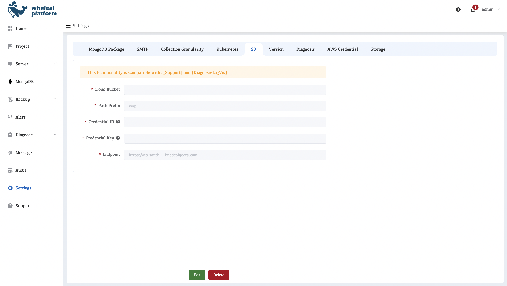
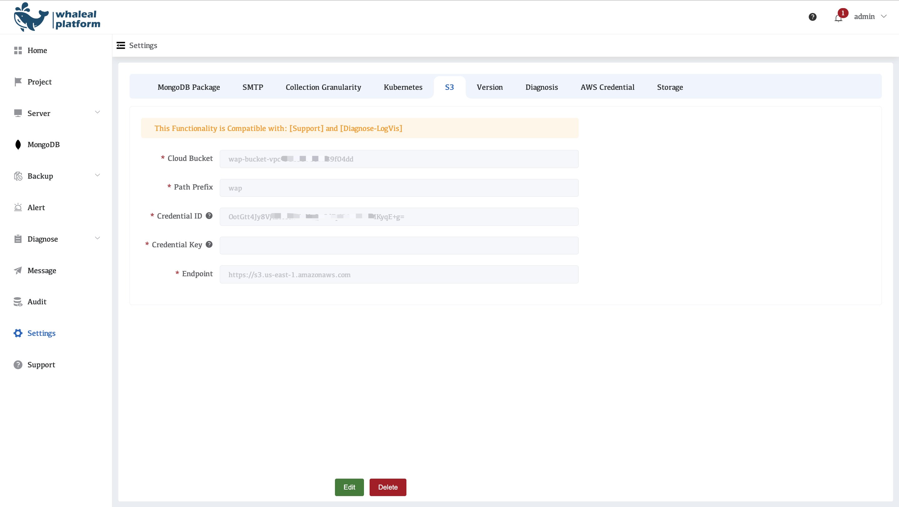

# Configure S3

Configure s3 storage for WAP. Some functions in WAP require s3 configuration to use, such as [Support](../14-support/01-cluster-inspection.md) and [Diagnose-LogVis](../10-diagnose/04-log-visualization.md). Here is how to configure s3 in the environment

After configuring [AWS Credential](./08-aws-credential.md), the S3 configuration will also be automatically configured. If you need to modify it, you can follow these steps.

## View s3 Configuration

1. Click on the left side of the setting
2. Click S3

### Example Modify S3 steps

1. Click Edit to edit the configuration

     

2. Configuring S3 Parameters

     | Parameters         | Description                                                  |
     | ------------------ | ------------------------------------------------------------ |
     | **Cloud Bucke**t   | Bucket name, for example, wap-bucket                         |
     | **Path Prefix**    | Storage path prefix, defaulting to wap, is used to distinguish different types of data or directories. |
     | **Credential ID**  | Access Key ID is used to identify your account.              |
     | **Credential Key** | A Secret Access Key paired with an Access Key ID is used for authentication and access control. |
     | **Endpoint**       | The object storage access endpoint URL is used to connect to and access the storage bucket. |
     
3. Click Seve

