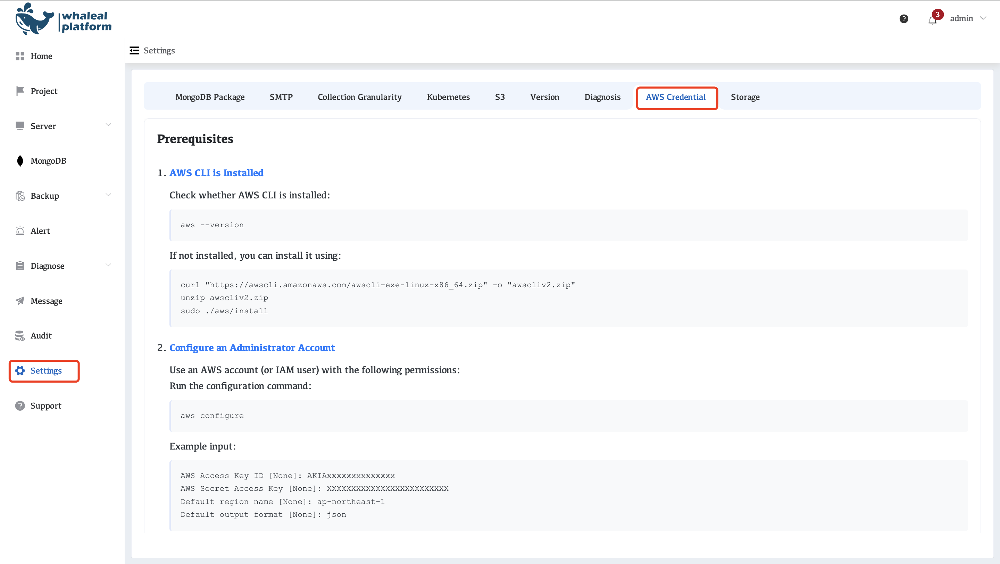
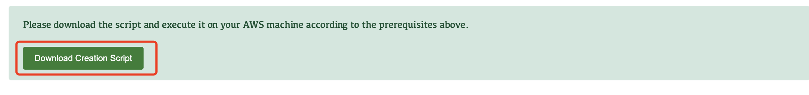
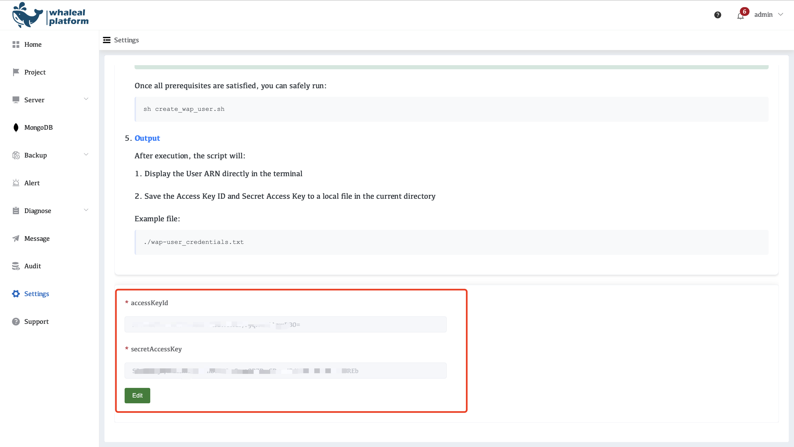

## AWS Credential

This document provides instructions for configuring the AWS CLI and creating an IAM user for integration with the Whaleal Platform (WAP).
 The generated AWS credentials will be used by WAP to access AWS resources for monitoring and management.



### 1、AWS CLI is Installed

Check whether AWS CLI is installed:

```
aws --version
```

If not installed, you can install it using:

```
curl "https://awscli.amazonaws.com/awscli-exe-linux-x86_64.zip" -o "awscliv2.zip"
unzip awscliv2.zip
sudo ./aws/install
```

After installation, re-run `aws --version` to confirm it was installed successfully.

### 2、Configure an Administrator Account

Use an AWS account (or IAM user) with the following permissions:
Run the configuration command:

```
aws configure
```

Example input:

```
AWS Access Key ID [None]: AKIAxxxxxxxxxxxxxx
AWS Secret Access Key [None]: XXXXXXXXXXXXXXXXXXXXXXXXX
Default region name [None]: ap-northeast-1
Default output format [None]: json
```

**Note:** Ensure the Access Key belongs to an account with sufficient permissions to create and manage IAM users.

### 3、Verify Configuration

Check if your credentials are valid by running:

```
aws sts get-caller-identity
```

Expected output:

```
{
"UserId": "AIDAxxxxxxxxxxxxxx",
"Account": "123456789012",
"Arn": "arn:aws:iam::123456789012:user/admin"
}
```

### 4、Execute the Script



Once all prerequisites are satisfied, you can safely run:

```
sh create_wap_user.sh
```

### 5、Output

After execution, the script will:

- Display the User ARN directly in the terminal
- Save the Access Key ID and Secret Access Key to a local file in the current directory

Example file:

```
./wap-user_credentials.txt
```

Open the `wap-user_credentials.txt` file, copy the `accessKeyId` and `secretAccessKey`, and paste them into the **WAP platform** to complete the configuration.


Click Save

