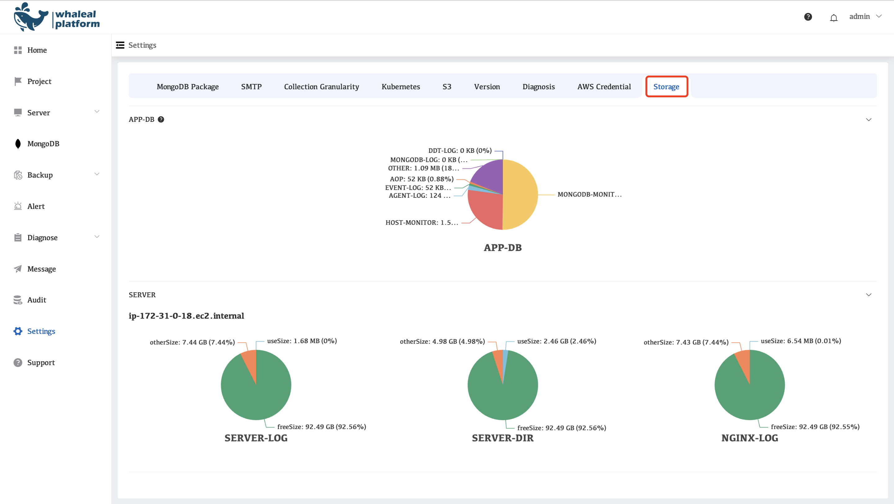

# Storage

Used to store and manage various types of data in the Whaleal Platform, including monitoring data, logs, and system-related information.

- **APP-DB**
   Indicates the proportion of monitoring data storage occupied by AppDB within the Whaleal Platform.
- **SERVER**
   Represents the storage usage of data generated and retained on the server side.
- **DDT**
   Displays the storage space consumed by platform backup data, helping users understand the impact and usage of backup data on overall storage resources.

