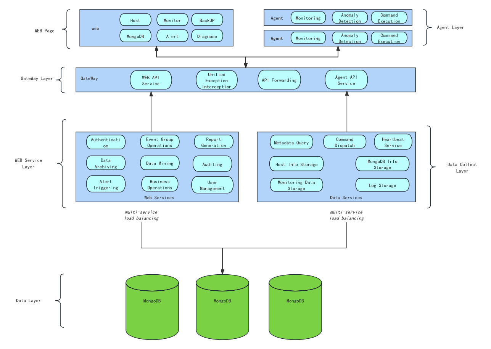

### WAP 4.0 Architecture Overview

## 1. Architectural Objectives

The WAP 4.0 architecture is designed around the following core objectives:

* Unified lifecycle management for MongoDB clusters
* Automated orchestration and delivery of AWS cloud resources
* High-availability, scalable platform service architecture
* Support for automated backup, restore, and elastic scaling
* Minimization of user operational complexity

---



## 2. System Overall Architecture

WAP 4.0 is composed of five layers: Control Layer, Service Layer, Orchestration Layer, Execution Layer, and Resource Layer:

```text
┌────────────────────────────────────────────┐
│                Control Layer (UI)          │
│  Web Console / User Entry / Permissions &  │
│  Project Management                         │
└────────────────────────────────────────────┘
                    │
                    ▼
┌────────────────────────────────────────────┐
│                Platform Service Layer      │
│  Backend Service Cluster / API Services /  │
│  Business Logic Processing                  │
│  User Management / Policy Management /     │
│  Task Management                             │
└────────────────────────────────────────────┘
                    │
                    ▼
┌────────────────────────────────────────────┐
│           Automated Orchestration &        │
│                Scheduling Layer            │
│  • AWS Resource Orchestration (EC2 / VPC / │
│    Subnets / Security Groups)              │
│  • MongoDB Cluster Automated Deployment     │
│  • Backup / Restore Workflow Orchestration │
│  • Elastic Scaling Policy Execution         │
└────────────────────────────────────────────┘
                    │
                    ▼
┌────────────────────────────────────────────┐
│             Execution & Collection Layer   │
│  Whaleal Agent / Command Execution /       │
│  Metrics Collection                          │
│  Log Collection / Status Reporting          │
└────────────────────────────────────────────┘
                    │
                    ▼
┌────────────────────────────────────────────┐
│                Resource Layer               │
│  AWS Cloud Resources (EC2/EBS/VPC, etc.)   │
│  MongoDB Clusters (Replica Sets / Sharded  │
│  Clusters)                                 │
│  Backup Nodes / Restore Nodes / Storage    │
└────────────────────────────────────────────┘
```


## 3. Core Components Description

### 3.1 Web Console (Control Layer)

* Provides a unified, visual interface
* Supports cluster creation, policy configuration, and status monitoring
* Abstracts underlying complex parameters, focusing on business objectives

### 3.2 Platform Service Layer

* Hosts the platform's core business logic
* Provides unified API interfaces
* Manages users, permissions, projects, policies, and tasks
* Coordinates interactions between various modules

### 3.3 Automated Orchestration & Scheduling Engine (Core Capability)

This module is the core capability of WAP 4.0, responsible for:

* Calling AWS APIs to automatically create cloud resources (EC2, VPC, Subnets, Security Groups, etc.)
* Automatically deploying MongoDB replica sets and sharded clusters
* Executing backup and restore workflows automatically
* Triggering scaling or instance upgrades based on thresholds and policies
* Managing resource lifecycles to avoid resource waste

### 3.4 Whaleal Agent (Execution & Collection Layer)

* Deployed on managed MongoDB nodes
* Executes operational commands from the platform
* Collects system and MongoDB metrics
* Reports task results and runtime status

### 3.5 Resource Layer (Managed Objects)

Resources ultimately managed and orchestrated by the platform include:

* AWS cloud infrastructure (EC2, EBS, VPC, subnets, etc.)
* MongoDB clusters (replica sets / sharded clusters)
* Backup and restore nodes
* Storage resources (e.g., object storage)

---

## 4. Typical Workflow Description

### Automated MongoDB Cluster Creation Workflow

1. The user initiates a "Create Cluster" operation via the console
2. The platform generates a deployment plan
3. The orchestration engine calls AWS APIs to provision infrastructure
4. MongoDB is automatically deployed and initialized
5. Agents are deployed and nodes are onboarded
6. The cluster becomes fully monitorable and manageable

### Automated Backup & Restore Workflow

* Users configure backup policies
* The platform automatically prepares the execution environment and performs backups
* During restore, recovery nodes and network configurations are automatically created
* The restored cluster is delivered fully operational

### Automated Scaling Workflow

* The platform continuously monitors capacity and load metrics
* Upon reaching thresholds, an evaluation is triggered
* Instances are automatically upgraded or storage expanded according to policies
* Entire workflow requires no manual intervention

---

## 5. Summary of Architectural Features

* MongoDB-specific management platform architecture
* Deep integration with AWS for infrastructure and database automation
* Clear separation of layers, ensuring scalability and maintainability
* Process-driven, automated operational capabilities, significantly reducing manual complexity

